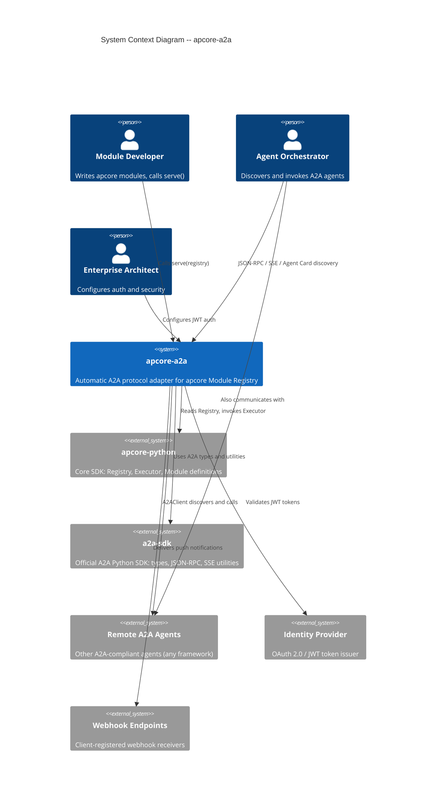
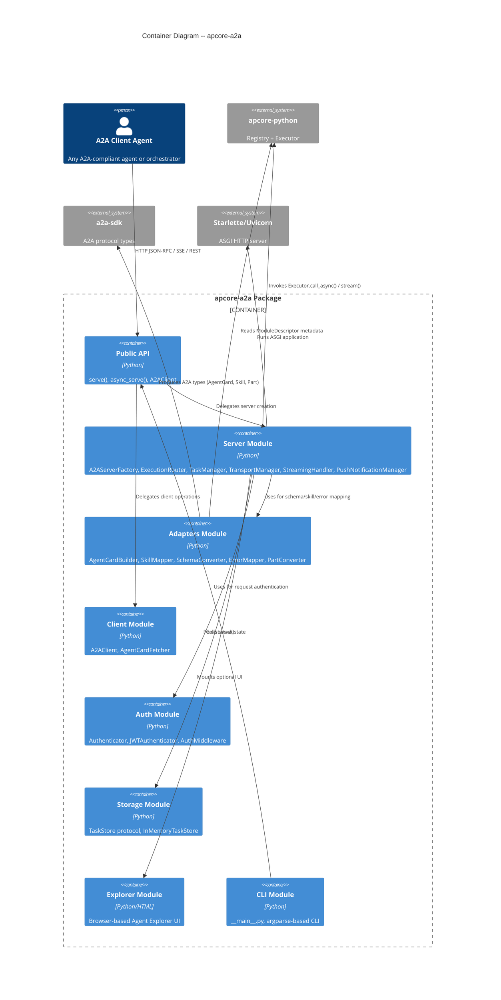
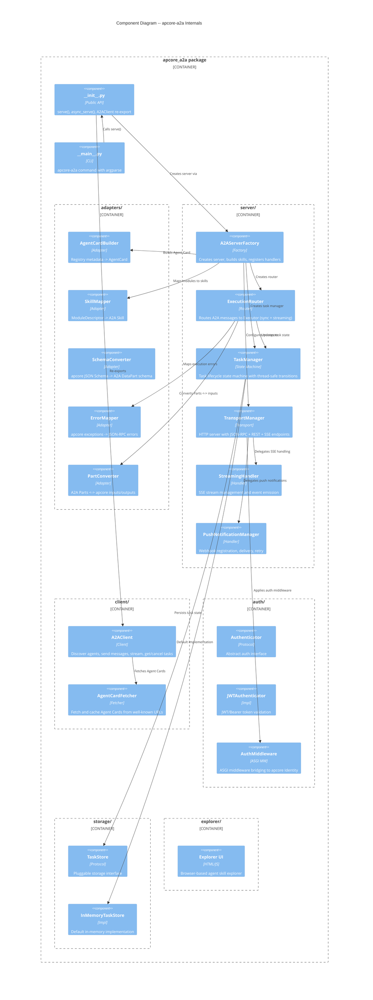
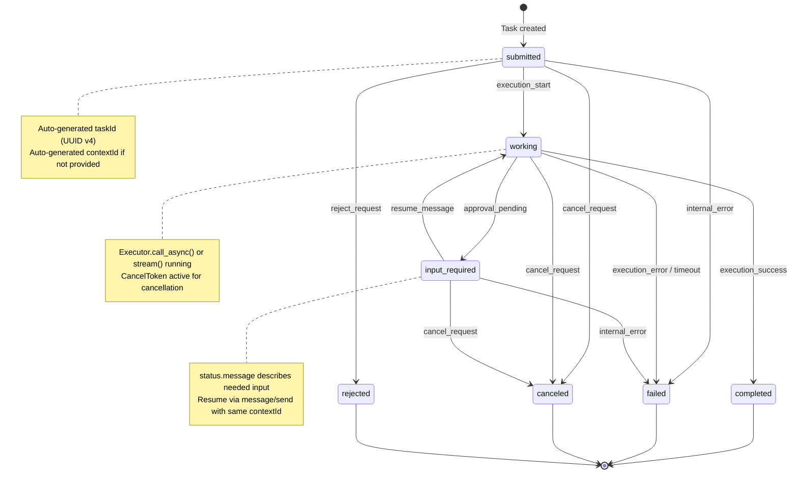
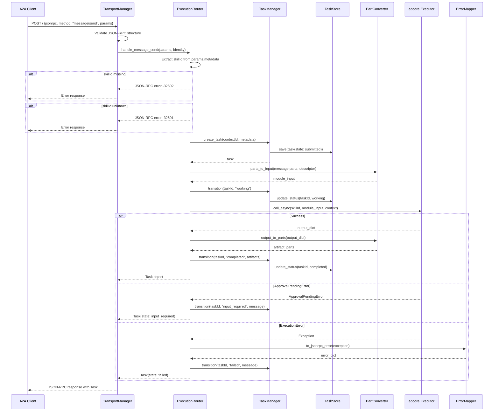
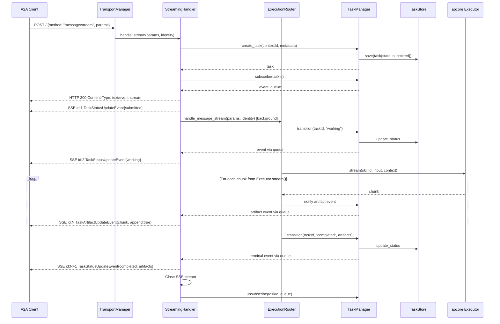
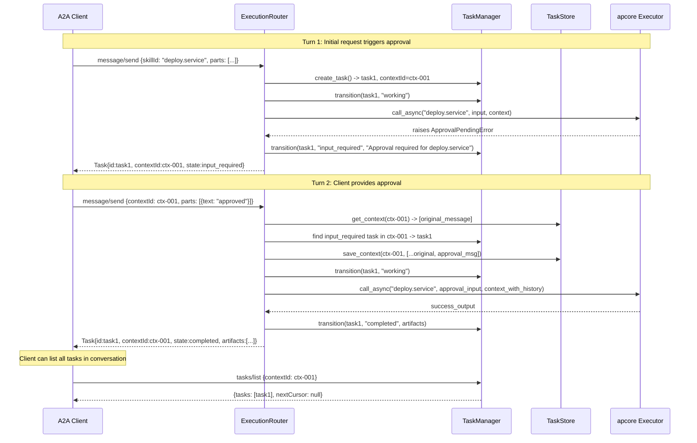
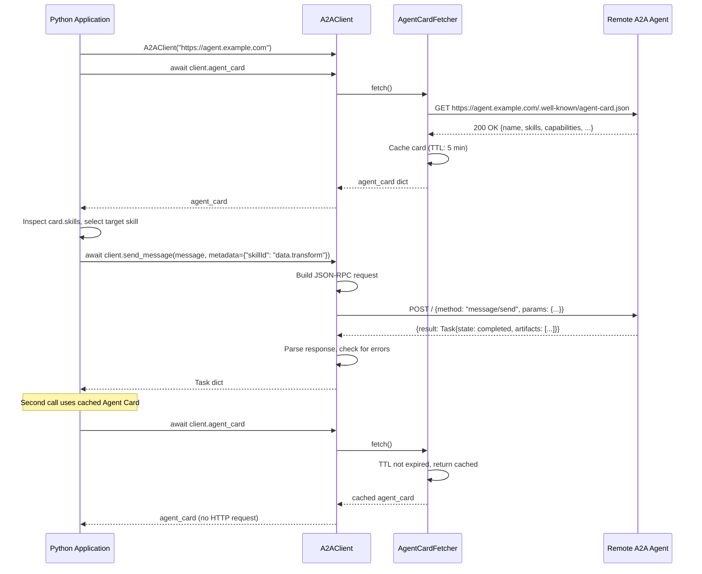
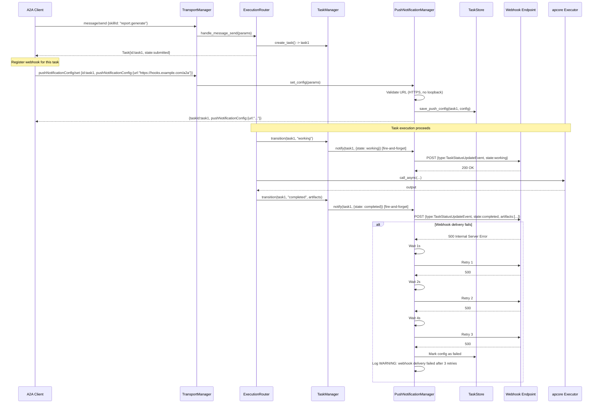
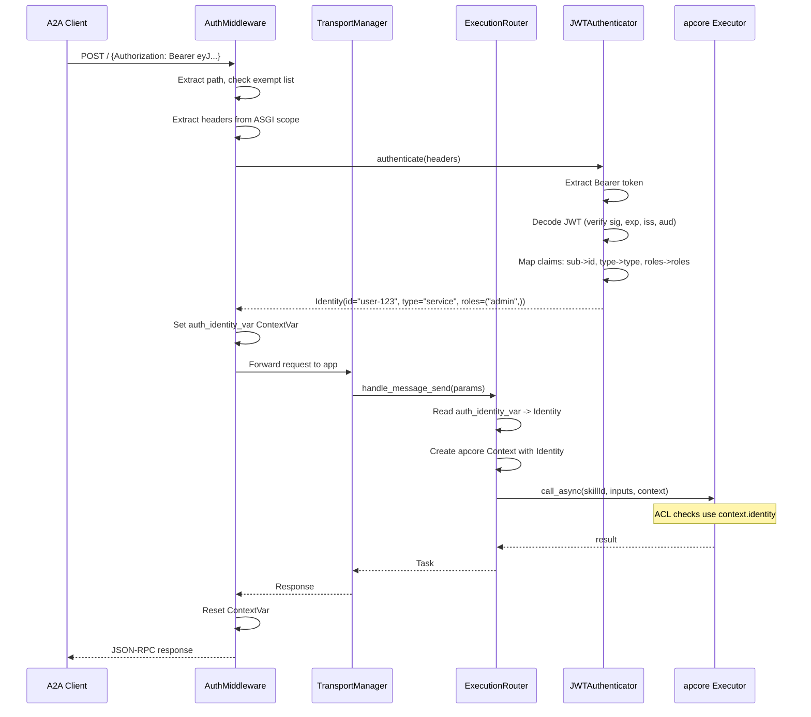

# Technical Design Document: apcore-a2a

| Field       | Value                                                                    |
|-------------|--------------------------------------------------------------------------|
| Title       | apcore-a2a: Automatic A2A Protocol Adapter for apcore Module Registry    |
| Document    | Technical Design Document (TDD)                                          |
| Document ID | TDD-APCORE-A2A-001                                                       |
| Version     | 1.0                                                                      |
| Date        | 2026-03-03                                                               |
| Author      | aiperceivable Engineering Team                                             |
| Status      | Draft                                                                    |
| PRD Ref     | `docs/prd.md` v1.0                                                      |
| SRS Ref     | `docs/srs.md` v1.0 (SRS-APCORE-A2A-001)                                |
| Standard    | Google Design Doc / RFC Template                                         |

---

## Revision History

| Version | Date       | Author                      | Description         |
|---------|------------|------------------------------|---------------------|
| 1.0     | 2026-03-03 | aiperceivable Engineering Team | Initial draft       |

---

## Table of Contents

1. [Overview](#1-overview)
2. [Background](#2-background)
3. [High-Level Architecture](#3-high-level-architecture)
4. [Detailed Design](#4-detailed-design)
5. [API Design](#5-api-design)
6. [Data Model](#6-data-model)
7. [Sequence Diagrams](#7-sequence-diagrams)
8. [Alternative Solutions](#8-alternative-solutions)
9. [Error Handling Strategy](#9-error-handling-strategy)
10. [Security Design](#10-security-design)
11. [Performance Considerations](#11-performance-considerations)
12. [Testing Strategy](#12-testing-strategy)
13. [Deployment](#13-deployment)
14. [Migration and Rollout](#14-migration-and-rollout)
15. [Monitoring and Observability](#15-monitoring-and-observability)
16. [Open Questions and Future Work](#16-open-questions-and-future-work)
17. [Traceability](#17-traceability)

---

## 1. Overview

### 1.1 Problem Statement

apcore modules carry rich, machine-readable metadata -- `input_schema`, `output_schema`, `description`, `annotations`, `tags`, `examples` -- that maps almost 1:1 to A2A (Agent-to-Agent) protocol concepts. Yet there is no automated path from an apcore Registry to a standards-compliant A2A agent server. Today, a developer who wants their modules callable by other AI agents must hand-author Agent Cards, implement JSON-RPC dispatch, build a task state machine, wire SSE streaming, and map errors -- roughly 500+ lines of boilerplate per deployment. This project eliminates that gap with a thin adapter that reads apcore metadata at runtime and produces a fully functional A2A 1.0 agent.

### 1.2 Goals

1. **Zero-boilerplate A2A agent**: `serve(registry)` launches a compliant A2A server with automatic Agent Card, skill mapping, task lifecycle, streaming, and error handling.
2. **Full A2A 1.0 compliance**: All JSON-RPC methods (`message/send`, `message/stream`, `tasks/get`, `tasks/cancel`, `tasks/resubscribe`, push notification CRUD), Agent Card discovery, SSE streaming.
3. **Executor pipeline preservation**: Every A2A task routes through `Executor.call_async()` or `Executor.stream()`, preserving ACL, validation, middleware, and timeout guarantees.
4. **Bidirectional agent participation**: Both an A2A server (other agents call us) and an `A2AClient` (we call other agents).
5. **Enterprise-ready auth**: JWT/Bearer authentication bridged to apcore Identity for ACL enforcement.
6. **Dual deployment**: Local `serve()` mode and Docker containerized deployment.

### 1.3 Non-Goals

1. **Reimplementing the A2A protocol** -- We use `a2a-sdk` for protocol types and utilities.
2. **Defining modules** -- That is `apcore-python`'s responsibility.
3. **gRPC binding** -- JSON-RPC + HTTP first; gRPC is future work.
4. **Agent Card cryptographic signing** -- Deferred to a future version.
5. **Persistent task storage** -- We define the `TaskStore` protocol; Redis/PostgreSQL implementations are out of scope for v1.
6. **Agent registry / directory service** -- External concern.

---

## 2. Background

### 2.1 A2A Protocol Overview

The Agent-to-Agent (A2A) protocol, originated by Google and now governed by the Linux Foundation, defines a standard for AI agents to discover, communicate, and delegate tasks to one another. Key protocol elements:

- **Agent Card** (`/.well-known/agent-card.json`): JSON document declaring an agent's identity, capabilities, skills, and security schemes.
- **JSON-RPC 2.0 binding**: All operations (`message/send`, `message/stream`, `tasks/*`) are dispatched via `POST /` with JSON-RPC 2.0 payloads.
- **Task lifecycle**: Stateful work units with states `submitted`, `working`, `completed`, `failed`, `canceled`, `input_required`.
- **SSE streaming**: `message/stream` returns `text/event-stream` with `TaskStatusUpdateEvent` and `TaskArtifactUpdateEvent`.
- **Push notifications**: Webhook-based async delivery of task state changes.
- **Parts**: Message and Artifact content uses typed Parts -- `TextPart`, `DataPart`, `FilePart`.

### 2.2 apcore Ecosystem Context

apcore is a schema-driven module development framework. Each module carries:
- `module_id`, `description`, `tags`, `examples` -- identity and discoverability
- `input_schema`, `output_schema` -- JSON Schema for inputs and outputs
- `annotations` -- behavioral flags (`readonly`, `destructive`, `idempotent`, `requires_approval`, `open_world`)

The `Registry` discovers and indexes modules. The `Executor` orchestrates execution through ACL enforcement, input validation, middleware, and timeout handling. This metadata is exactly what A2A needs for Agent Cards and Skills.

### 2.3 Relationship to apcore-mcp

apcore-mcp-python (v0.7.0+) is the sibling adapter for the Model Context Protocol. Both adapters follow the same layered architecture:

| Layer | apcore-mcp | apcore-a2a (this project) |
|-------|-----------|---------------------------|
| Public API | `serve(registry)` | `serve(registry)` |
| Adapters | `SchemaConverter`, `AnnotationMapper`, `ErrorMapper` | `AgentCardBuilder`, `SkillMapper`, `SchemaConverter`, `ErrorMapper`, `PartConverter` |
| Server | `MCPServerFactory`, `ExecutionRouter`, `TransportManager` | `A2AServerFactory`, `ExecutionRouter`, `TaskManager`, `TransportManager`, `StreamingHandler`, `PushNotificationManager` |
| Auth | `JWTAuthenticator`, `AuthMiddleware` | `JWTAuthenticator`, `AuthMiddleware` |
| Client | N/A (MCP is server-only) | `A2AClient`, `AgentCardFetcher` |
| Storage | N/A (MCP is stateless) | `TaskStore`, `InMemoryTaskStore` |

Key differences from apcore-mcp:
- **Stateful**: A2A has a task lifecycle with persistent state; MCP is stateless per-call.
- **Client module**: A2A agents are bidirectional; apcore-a2a includes a client for calling remote agents.
- **Storage layer**: Task state persistence requires a pluggable store.
- **Push notifications**: Webhook-based async delivery has no MCP equivalent.
- **SSE streaming model**: A2A uses typed events (`TaskStatusUpdateEvent`, `TaskArtifactUpdateEvent`) rather than MCP's progress notifications.

---

## 3. High-Level Architecture

### 3.1 System Context Diagram (C4 Level 1)



### 3.2 Container Diagram (C4 Level 2)



### 3.3 Key Architectural Decisions

| ID | Decision | Rationale | Alternatives Rejected |
|----|----------|-----------|----------------------|
| AD-01 | Hybrid SDK integration: use `a2a-sdk` for types but custom server layer | a2a-sdk's built-in server is too opinionated for our Executor routing needs; its types ensure A2A compliance | (A) Pure SDK server -- insufficient control; (B) No SDK -- reimplementation risk |
| AD-02 | Starlette as the ASGI framework | Lightweight, battle-tested, matches apcore-mcp pattern, native SSE support | FastAPI (too heavy), raw ASGI (too low-level) |
| AD-03 | `TaskStore` as a runtime-checkable Protocol | Enables pluggable storage without inheritance coupling; matches apcore's duck-typing philosophy | ABC (too rigid), no abstraction (not extensible) |
| AD-04 | asyncio locks (not threading locks) for task state | Server is async (uvicorn); asyncio locks are correct for single-threaded event loop with cooperative multitasking | threading.Lock (wrong concurrency model), no locking (data races) |
| AD-05 | Client module has zero server-side imports | `from apcore_a2a.client import A2AClient` must not pull in starlette/uvicorn; enables lightweight client-only usage | Shared module (import bloat) |
| AD-06 | Agent Card pre-computed and cached in memory | Eliminates per-request generation cost; satisfies NFR-PERF-001 (<10ms p99) | Per-request generation (too slow), file-based caching (unnecessary I/O) |
| AD-07 | ContextVar bridge for Identity | Same pattern as apcore-mcp; integrates cleanly with async request handling | Thread-local (wrong for async), request parameter (invasive) |

---

## 4. Detailed Design

### 4.1 Component Diagram (C4 Level 3)



### 4.2 Public API Layer (`__init__.py`)

**Implements**: FR-SRV-001, FR-SRV-002, FR-SRV-003

#### 4.2.1 `serve()` Function

=== "Python"

    ```python
    def serve(
        registry_or_executor: object,
        *,
        host: str = "0.0.0.0",
        port: int = 8000,
        name: str | None = None,
        description: str | None = None,
        version: str | None = None,
        auth: Authenticator | None = None,
        task_store: TaskStore | None = None,
        cors_origins: list[str] | None = None,
        push_notifications: bool = False,
        explorer: bool = False,
        explorer_prefix: str = "/explorer",
        cancel_on_disconnect: bool = True,
        shutdown_timeout: int = 30,
        execution_timeout: int = 300,
        log_level: str | None = None,
    ) -> None:
    ```

=== "TypeScript"

    ```typescript
    // serve() takes a single options object; host/port live in ServeOptions.
    export function serve(registryOrExecutor: unknown, opts?: ServeOptions): void

    export interface ServeOptions extends AsyncServeOptions {
      host?: string; port?: number; logLevel?: string; shutdownTimeout?: number;
    }
    export interface AsyncServeOptions {
      name?: string; description?: string; version?: string; url?: string;
      auth?: Authenticator; taskStore?: TaskStore; corsOrigins?: string[];
      pushNotifications?: boolean; explorer?: boolean; explorerPrefix?: string;
      executionTimeout?: number; metrics?: boolean; sysModules?: boolean;
    }
    ```

=== "Rust"

    ```rust
    // Rust folds host+port into config.url (no host/port fields); auth is passed
    // via the *_with_auth entry points, not a config field.
    pub async fn serve(source: BackendSource, config: APCoreA2AConfig) -> Result<(), APCoreA2AError>

    pub struct APCoreA2AConfig {
        pub name: String,            // "apcore-a2a"
        pub description: String,     // "apcore A2A agent"
        pub version: String,         // VERSION
        pub url: String,             // "http://localhost:8000" (bind addr derived from this)
        pub execution_timeout: u64,  // 300
        pub explorer: bool,          // false
        pub metrics: bool,           // false (INERT in Rust)
        pub sys_modules: bool,       // false
        pub cors_origins: Vec<String>, // []
    }
    ```

**Behavior:**

1. Resolve `registry_or_executor` to both a Registry and an Executor using duck-typing (same pattern as apcore-mcp's `resolve_registry()` / `resolve_executor()`). If the object has `list()` and `get_definition()`, treat as Registry and wrap in Executor. If it has `call_async()`, treat as Executor and extract its Registry.
2. Validate that the Registry has at least one module; raise `ValueError("Registry contains zero modules; at least one module is required to serve an A2A agent")` if empty.
3. Resolve `name` from Registry config `project.name`, falling back to `"Apcore Agent"`.
4. Resolve `version` from Registry config `project.version`, falling back to `"0.0.0"`.
5. Resolve `description` from Registry config `project.description`, falling back to `f"apcore agent with {len(modules)} skills"`.
6. Default `task_store` to `InMemoryTaskStore()` if `None`.
7. Validate `auth` satisfies the `Authenticator` protocol if provided; raise `TypeError` listing missing methods otherwise.
8. Validate `task_store` satisfies the `TaskStore` protocol if custom; raise `TypeError` listing missing methods otherwise.
9. Build the ASGI application via `async_serve()` internals.
10. Configure signal handlers for SIGINT / SIGTERM for graceful shutdown with `shutdown_timeout`.
11. Run `uvicorn.Server` with the ASGI app, blocking until shutdown.

#### 4.2.2 `async_serve()` Function

=== "Python"

    ```python
    async def async_serve(
        registry_or_executor: object,
        *,
        # Same kwargs as serve() except host and port
        name: str | None = None,
        description: str | None = None,
        version: str | None = None,
        auth: Authenticator | None = None,
        task_store: TaskStore | None = None,
        cors_origins: list[str] | None = None,
        push_notifications: bool = False,
        explorer: bool = False,
        explorer_prefix: str = "/explorer",
        cancel_on_disconnect: bool = True,
        execution_timeout: int = 300,
    ) -> Starlette:
    ```

=== "TypeScript"

    ```typescript
    // Returns a Promise<Express> (an Express app) — not a Starlette app.
    export async function asyncServe(registryOrExecutor: unknown, opts?: AsyncServeOptions): Promise<Express>
    ```

=== "Rust"

    ```rust
    // async_serve runs the server; build_app returns the axum Router for embedding.
    pub async fn async_serve(source: BackendSource, config: APCoreA2AConfig) -> Result<(), APCoreA2AError>
    pub async fn build_app(source: BackendSource, config: APCoreA2AConfig) -> Result<(Router, AgentCard), APCoreA2AError>
    ```

Returns a configured Starlette ASGI application without starting uvicorn. Suitable for embedding in existing ASGI servers.

#### 4.2.3 `A2AClient` Re-export

=== "Python"

    ```python
    from apcore_a2a.client import A2AClient
    ```

=== "TypeScript"

    ```typescript
    import { A2AClient } from "apcore-a2a";
    ```

=== "Rust"

    ```rust
    use apcore_a2a::A2AClient;
    ```

Re-exported at the package level for convenience. The client module has no server-side imports.

### 4.3 Adapters Module (`adapters/`)

#### 4.3.1 `AgentCardBuilder`

**Implements**: FR-AGC-001, FR-AGC-002, FR-AGC-003, FR-AGC-004, FR-AGC-005

**File**: `adapters/agent_card.py`

=== "Python"

    ```python
    class AgentCardBuilder:
        def __init__(self, skill_mapper: SkillMapper) -> None:
            self._skill_mapper = skill_mapper
            self._cached_card: dict | None = None
            self._cached_extended_card: dict | None = None

        def build(
            self,
            registry: object,
            *,
            name: str,
            description: str,
            version: str,
            url: str,
            capabilities: dict[str, bool],
            security_schemes: dict | None = None,
        ) -> dict:
            """Build A2A Agent Card from Registry metadata.

            Returns:
                dict conforming to A2A 1.0 Agent Card JSON Schema.
            """

        def build_extended(
            self,
            registry: object,
            *,
            base_card: dict,
            auth_modules: list[str],
        ) -> dict:
            """Build extended Agent Card including auth-restricted skills."""

        def invalidate_cache(self) -> None:
            """Invalidate cached cards. Called on module registration changes."""
    ```

=== "TypeScript"

    ```typescript
    class AgentCardBuilder {
      constructor(skillMapper: SkillMapper)
      build(registry, { name, description, version, url, capabilities, securitySchemes? }): AgentCard
      getCachedOrBuild(...): AgentCard
      buildExtended(baseCard): AgentCard
      invalidateCache(): void
    }
    ```

=== "Rust"

    ```rust
    impl AgentCardBuilder {
        pub fn new(skill_mapper: SkillMapper) -> Self
        pub fn build(&self, registry: &Registry, name: &str, description: &str, version: &str, url: &str, capabilities: AgentCapabilities, security_schemes: Option<Value>) -> AgentCard
        pub fn build_extended(&self, base_card: &AgentCard) -> AgentCard
        pub fn get_cached_or_build(&self, registry: &Registry, name: &str, description: &str, version: &str, url: &str, capabilities: AgentCapabilities, security_schemes: Option<Value>) -> AgentCard
        pub fn invalidate_cache(&self)
    }
    ```

**Build logic:**

1. Iterate `registry.list()` to get all module IDs.
2. For each module ID, call `registry.get_definition(module_id)` to get the `ModuleDescriptor`.
3. Skip modules with empty or `None` description; log warning: `"Skipping module {module_id}: missing description"`.
4. Convert each descriptor to a Skill via `SkillMapper.to_skill(descriptor)`.
5. Separate public skills (no ACL restriction, no `requires_approval`) from restricted skills.
6. Compute capabilities (A2A 1.0 `AgentCapabilities`):
   - `streaming`: `True` (executor streaming is always available; non-streaming modules fall back to a single chunk).
   - `pushNotifications`: from configuration parameter.
   - `extensions`: `[]` (A2A protocol extensions; none by default).
   - `extendedAgentCard`: `True` if security schemes are configured. (A2A 1.0 removed the 0.3 `stateTransitionHistory` capability; task history is still recorded by stores that support it, it is simply no longer advertised as a capability flag.)
7. Construct the A2A 1.0 Agent Card with fields: `name`, `description`, `version`, `supportedInterfaces` (`[{url, protocolBinding:"JSONRPC", protocolVersion:"1.0", tenant:""}]`, replacing the 0.3 top-level `url`), `provider`, `skills`, `capabilities`, `defaultInputModes`, `defaultOutputModes`, `securitySchemes`, `securityRequirements`, `signatures`.
8. If `security_schemes` provided, populate the `securitySchemes` map.
9. Cache the card in memory. Return the cached dict (not a copy -- immutable after build).

**Agent Card response headers:**
- `Content-Type: application/json`
- `Cache-Control: max-age=300`

#### 4.3.2 `SkillMapper`

**Implements**: FR-SKL-001, FR-SKL-002, FR-SKL-003, FR-SKL-004

**File**: `adapters/skill_mapper.py`

=== "Python"

    ```python
    class SkillMapper:
        def to_skill(self, descriptor: object) -> dict:
            """Convert ModuleDescriptor to A2A Skill dict.

            Mapping:
                descriptor.module_id     -> Skill.id
                humanize(module_id)      -> Skill.name
                descriptor.description   -> Skill.description
                descriptor.tags          -> Skill.tags
                descriptor.examples[:10] -> Skill.examples
                computed                 -> Skill.inputModes, outputModes
                (annotations are NOT mapped to the Skill — see note below)
            """

        def _humanize_module_id(self, module_id: str) -> str:
            """Convert 'image.resize' to 'Image Resize'."""
            return module_id.replace(".", " ").replace("_", " ").title()

        def _compute_input_modes(self, descriptor: object) -> list[str]:
            """Determine inputModes from input_schema."""

        def _compute_output_modes(self, descriptor: object) -> list[str]:
            """Determine outputModes from output_schema."""

        def _build_examples(self, descriptor: object) -> list[dict]:
            """Convert apcore examples to A2A Skill examples (max 10)."""
    ```

=== "TypeScript"

    ```typescript
    class SkillMapper {
      constructor(schemaConverter?: SchemaConverter)
      // Convert ModuleDescriptor to an AgentSkill (or null when skipped).
      toSkill(descriptor: ModuleDescriptor, moduleId?: string): AgentSkill | null
      // "image.resize" -> "Image Resize"
      humanizeModuleId(moduleId: string): string
    }
    ```

=== "Rust"

    ```rust
    impl SkillMapper {
        pub fn new() -> Self
        // Convert a module descriptor to an AgentSkill.
        pub fn to_skill(&self, module_id: &str, descriptor: &ModuleDescriptor, description: &str) -> AgentSkill
    }
    ```

**Input/output mode logic:**

| Schema condition | Resulting modes |
|-----------------|----------------|
| `input_schema` defined with root type `object` | `["application/json"]` |
| `input_schema` defined with root type `string` or single string property | `["application/json", "text/plain"]` |
| No `input_schema` | `["text/plain"]` |
| `output_schema` defined | `["application/json"]` |
| No `output_schema` | `["text/plain"]` |

**Note on annotations:** apcore module annotations are **not** mapped onto the A2A
Skill. The A2A 1.0 `AgentSkill` type has no `extensions` field, so there is no
`_build_extensions()` method and no `extensions.apcore.annotations` payload.
Annotations (`readonly`, `destructive`, `idempotent`, `requires_approval`,
`open_world`) are instead surfaced through the Explorer UI's `_inputSchemas`
enrichment, keeping the standard Agent Card free of apcore-specific fields.

#### 4.3.3 `SchemaConverter`

**Implements**: FR-MSG-003 (input parsing), FR-MSG-004 (output conversion)

**File**: `adapters/schema.py`

Reuses the same approach as apcore-mcp's `SchemaConverter`: deep-copy schemas, inline `$ref`/`$defs`, ensure root `type: object`. Extended for A2A-specific needs:

=== "Python"

    ```python
    class SchemaConverter:
        def convert_input_schema(self, descriptor: object) -> dict:
            """Convert apcore input_schema for A2A DataPart usage.
            Inlines $refs, strips $defs, ensures root type."""

        def convert_output_schema(self, descriptor: object) -> dict:
            """Convert apcore output_schema for A2A Artifact metadata."""

        def detect_root_type(self, schema: dict) -> str:
            """Return 'string', 'object', or 'unknown' based on schema root type.
            Used by SkillMapper to determine input/output modes."""
    ```

=== "TypeScript"

    ```typescript
    class SchemaConverter {
      convertInputSchema(descriptor): JsonSchema
      convertOutputSchema(descriptor): JsonSchema
      // "string" | "object" | "unknown"
      detectRootType(schema): "string" | "object" | "unknown"
    }
    ```

=== "Rust"

    ```rust
    impl SchemaConverter {
        pub fn new() -> Self
        pub fn convert_input_schema(&self, schema: &Value) -> Value
        pub fn convert_output_schema(&self, schema: &Value) -> Value
        // "string" | "object" | "unknown"
        pub fn detect_root_type(&self, schema: Option<&Value>) -> &'static str
    }
    ```

#### 4.3.4 `ErrorMapper`

**Implements**: FR-ERR-001 through FR-ERR-008

**File**: `adapters/errors.py`

=== "Python"

    ```python
    class ErrorMapper:
        # apcore error code -> (JSON-RPC code, message template, sanitize?)
        _ERROR_MAP: dict[str, tuple[int, str, bool]] = {
            "MODULE_NOT_FOUND":           (-32601, None, True),   # message = sanitized original
            "SCHEMA_VALIDATION_ERROR":    (-32602, None, True),   # message = sanitized original
            "GENERAL_INVALID_INPUT":      (-32602, "Invalid input",                True),
            "ACL_DENIED":                 (-32001, "Task not found",               True),
            "MODULE_TIMEOUT":             (-32603, "Execution timeout",            False),
            "EXECUTION_CANCELLED":        (-32603, "Execution cancelled",          False),
            "CALL_DEPTH_EXCEEDED":        (-32603, "Safety limit exceeded",        True),
            "CIRCULAR_CALL":              (-32603, "Safety limit exceeded",        True),
            "CALL_FREQUENCY_EXCEEDED":    (-32603, "Safety limit exceeded",        True),
            "CIRCUIT_BREAKER_OPEN":       (-32603, "Service temporarily unavailable", False),
            "TASK_LIMIT_EXCEEDED":        (-32603, "Service temporarily unavailable", False),
            "MODULE_DISABLED":            (-32603, "Module is currently disabled", False),
            "CONFIG_NAMESPACE_DUPLICATE": (-32603, "Configuration error",          False),
            "CONFIG_MOUNT_ERROR":         (-32603, "Configuration error",          False),
            "CONFIG_BIND_ERROR":          (-32603, "Configuration error",          False),
            # Any other code (or a bare Exception) -> (-32603, "Internal server error", False)
        }

        def to_jsonrpc_error(self, error: Exception) -> dict:
            """Convert apcore exception to JSON-RPC error response dict.

            Returns:
                dict with keys: code (int), message (str). Per the v0.4 decision
                (see Section 9.5), no `data` field is emitted; details go in `message`.
            """

        def _sanitize_message(self, message: str) -> str:
            """Remove file paths, stack traces, config values from message."""
    ```

=== "TypeScript"

    ```typescript
    // Same error-code mapping; messages are sanitized (strips paths/tracebacks, caps 500 chars).
    // MODULE_NOT_FOUND->-32601; SCHEMA_VALIDATION_ERROR->-32602; MODULE_TIMEOUT->-32603
    // ("Execution timeout"); EXECUTION_CANCELLED->-32603; ACL_DENIED->-32001; others->-32603.
    class ErrorMapper {
      format(error, context?): Record<string, unknown>
      toJsonRpcError(error): { code: number; message: string }
    }
    ```

=== "Rust"

    ```rust
    // Same error-code mapping; messages are sanitized (strips paths/tracebacks, truncates 500).
    // ModuleNotFound->-32601; SchemaValidationError->-32602; ACLDenied->-32001;
    // ModuleTimeout->-32603 ("Execution timeout"); ExecutionCancelled->-32603; others->-32603.
    impl ErrorMapper {
        pub fn to_jsonrpc_error(error: &ModuleError) -> JsonRpcError
    }
    ```

**Error mapping table (complete):**

> The JSON-RPC error object is `{code, message}` only; no `data` field is emitted in v0.4. The error type is not exposed to clients.

| apcore Exception | JSON-RPC Code | Message | Sanitized |
|-----------------|:---:|---------|:---------:|
| `ModuleNotFoundError` | -32601 | sanitized original message | Yes |
| `SchemaValidationError` | -32602 | sanitized original message (field details preserved) | Yes |
| `ACLDeniedError` | -32001 | `"Task not found"` | Yes (masking true type) |
| `GeneralInvalidInputError` | -32602 | `"Invalid input: {description}"` | Yes |
| `ModuleTimeoutError` | -32603 | `"Execution timeout"` | No |
| `ExecutionCancelledError` | -32603 | `"Execution cancelled"` | No |
| `CallDepthExceededError` | -32603 | `"Safety limit exceeded"` | Yes |
| `CircularCallError` | -32603 | `"Safety limit exceeded"` | Yes |
| `CallFrequencyExceededError` | -32603 | `"Safety limit exceeded"` | Yes |
| `CircuitBreakerOpenError` / `TaskLimitExceededError` | -32603 | `"Service temporarily unavailable"` | No |
| `ModuleDisabledError` | -32603 | `"Module is currently disabled"` | No |
| `ConfigNamespaceDuplicate` / `ConfigMountError` / `ConfigBindError` | -32603 | `"Configuration error"` | No |
| `ApprovalPendingError` | N/A | N/A (task transitions to `input_required`) | N/A |
| Unknown `Exception` | -32603 | `"Internal server error"` | No |

**Sanitization rules:**
1. Strip any substring matching a file path pattern (`/.../.../...`).
2. Strip Python traceback lines (lines starting with `Traceback`, `File "`, or containing `line \d+`).
3. Truncate final message to 500 characters.
4. Log the full unsanitized exception at ERROR level with stack trace.

#### 4.3.5 `PartConverter`

**Implements**: FR-MSG-003, FR-MSG-004

**File**: `adapters/parts.py`

=== "Python"

    ```python
    class PartConverter:
        def __init__(self, schema_converter: SchemaConverter) -> None:
            self._schema_converter = schema_converter

        def parts_to_input(
            self,
            parts: list[dict],
            descriptor: object,
        ) -> dict | str:
            """Convert A2A message Parts to apcore module input.

            Logic:
            1. If parts is empty, raise ValueError("Message must contain at least one Part").
            2. Exactly one Part is accepted; if more than one Part is present, raise
               ValueError("Multiple parts are not supported; expected exactly one Part").
            3. For DataPart with mediaType 'application/json': return data dict directly.
            4. For TextPart when input_schema root type is 'string': return text string.
            5. For TextPart when input_schema root type is 'object': attempt JSON parse.
               - On parse failure: raise ValueError("Invalid JSON in TextPart").
            6. FilePart is not supported: raise ValueError("FilePart is not supported").
            """

        def output_to_parts(self, output: object) -> list[dict]:
            """Convert apcore module output to A2A Artifact Parts.

            Logic:
            1. If output is None: return [] (empty parts list).
            2. If output is dict: return [DataPart(data=output, mediaType="application/json")].
            3. If output is str: return [TextPart(text=output)].
            4. If output is list: return [TextPart(text=json.dumps(output))].
            5. Any other type: return [TextPart(text=str(output))].
            """
    ```

=== "TypeScript"

    ```typescript
    class PartConverter {
      constructor(schemaConverter?: SchemaConverter)
      partsToInput(parts: Part[], descriptor: ModuleDescriptor | null): Record<string, unknown> | string
      outputToParts(output: unknown, taskId?: string): Artifact
    }
    ```

=== "Rust"

    ```rust
    impl PartConverter {
        pub fn new(schema_converter: SchemaConverter) -> Self
        pub fn convert_result(&self, result: &Value) -> Vec<Part>
        pub fn output_to_parts(&self, output: &Value, task_id: &str) -> Artifact
        pub fn parts_to_input(&self, parts: &[Part], input_schema: Option<&Value>) -> Result<Value, String>
    }
    ```

### 4.4 Server Module (`server/`)

#### 4.4.1 `A2AServerFactory`

**Implements**: FR-SRV-001, FR-SRV-002, FR-AGC-001

**File**: `server/factory.py`

=== "Python"

    ```python
    class A2AServerFactory:
        def __init__(self) -> None:
            self._skill_mapper = SkillMapper()
            self._schema_converter = SchemaConverter()
            self._agent_card_builder = AgentCardBuilder(self._skill_mapper)
            self._error_mapper = ErrorMapper()
            self._part_converter = PartConverter(self._schema_converter)

        def create(
            self,
            registry: object,
            executor: object,
            *,
            name: str,
            description: str,
            version: str,
            url: str,
            task_store: TaskStore,
            auth: Authenticator | None = None,
            push_notifications: bool = False,
            cancel_on_disconnect: bool = True,
            execution_timeout: int = 300,
            cors_origins: list[str] | None = None,
            explorer: bool = False,
            explorer_prefix: str = "/explorer",
        ) -> tuple[Starlette, dict]:
            """Create the ASGI application and Agent Card.

            Returns:
                (app, agent_card) tuple.
            """
    ```

=== "TypeScript"

    ```typescript
    class A2AServerFactory {
      // Returns { app: Express, agentCard: AgentCard }.
      create(registry, executor: { callAsync(moduleId, inputs?, context?): Promise<...> }, opts: A2AServerCreateOptions): { app: Express; agentCard: AgentCard }
      registerModule(moduleId: string, descriptor: unknown): void
    }
    interface A2AServerCreateOptions {
      name; description; version; url; taskStore?; auth?; executionTimeout?;
      corsOrigins?; pushNotifications?; explorer?; explorerPrefix?; metrics?; sysModules?;
    }
    ```

=== "Rust"

    ```rust
    impl A2AServerFactory {
        pub fn new() -> Self  // registers A2A namespace + error formatter
        // Returns (axum Router, AgentCard). Host/port come from `url`; auth is an
        // Option<Arc<dyn Authenticator>> argument (no auth config field).
        pub fn create(&self, registry: &Registry, executor: Arc<ApCoreAgentExecutor>, task_store: Arc<dyn TaskStore>,
                      name: &str, description: &str, version: &str, url: &str,
                      auth: Option<Arc<dyn Authenticator>>, explorer: bool, explorer_prefix: &str) -> (Router, AgentCard)
    }
    ```

**Creation sequence:**

1. Build skills via `_skill_mapper` from all registry modules.
2. Build Agent Card via `_agent_card_builder.build(...)`.
3. Create `TaskManager(task_store)`.
4. Create `ExecutionRouter(executor, task_manager, part_converter, error_mapper, execution_timeout)`.
5. Create `StreamingHandler(task_manager)`.
6. Optionally create `PushNotificationManager(task_store)`.
7. Build Starlette routes:
   - `GET /.well-known/agent-card.json` -> serve Agent Card
   - `POST /` -> JSON-RPC dispatch
   - `GET /health` -> health check
   - `GET /metrics` -> metrics (if enabled)
   - `GET /agent/authenticatedExtendedCard` -> extended card (if auth configured)
8. Optionally mount Explorer UI at `explorer_prefix`.
9. Apply `AuthMiddleware` if `auth` is provided, with exempt paths: `{"/.well-known/agent-card.json", "/.well-known/agent.json", "/health", "/metrics"}` (the 0.3 `agent.json` alias is public discovery and must stay exempt).
10. Apply CORS middleware if `cors_origins` is provided.

#### 4.4.2 `ExecutionRouter`

> **Implementation Note**: `ExecutionRouter` has been superseded by `a2a-sdk`'s `DefaultRequestHandler` (with the apcore `AgentExecutor` adapter). This section reflects the original design intent; behavior is otherwise equivalent.

**Implements**: FR-EXE-001, FR-EXE-002, FR-EXE-003, FR-MSG-001, FR-MSG-002

**File**: `server/router.py`

```python
class ExecutionRouter:
    def __init__(
        self,
        executor: object,
        task_manager: TaskManager,
        part_converter: PartConverter,
        error_mapper: ErrorMapper,
        execution_timeout: int = 300,
    ) -> None:
        self._executor = executor
        self._task_manager = task_manager
        self._part_converter = part_converter
        self._error_mapper = error_mapper
        self._execution_timeout = execution_timeout
        self._call_async_accepts_context = self._check_accepts_context(executor.call_async)
        self._stream_accepts_context = self._check_accepts_context(
            getattr(executor, "stream", None)
        )

    async def handle_message_send(
        self,
        params: dict,
        identity: Identity | None = None,
    ) -> dict:
        """Handle message/send: synchronous execution.

        Steps:
        1. Extract skillId from params.metadata.skillId.
           - Missing: return JSON-RPC error -32602.
           - Unknown skill: return JSON-RPC error -32601.
        2. Create Task via task_manager (state: submitted).
        3. Parse Parts to module input via part_converter.
        4. Transition task to working.
        5. Build apcore Context with identity (if authenticated).
        6. Invoke executor.call_async(skill_id, inputs, context).
        7. On success: convert output to Artifact Parts, transition to completed.
        8. On ApprovalPendingError: transition to input_required.
        9. On other error: transition to failed, map error via error_mapper.
        10. Return Task object.
        """

    async def handle_message_stream(
        self,
        params: dict,
        identity: Identity | None = None,
    ) -> AsyncGenerator[dict, None]:
        """Handle message/stream: SSE streaming execution.

        Yields TaskStatusUpdateEvent and TaskArtifactUpdateEvent dicts.
        """

    async def handle_resume(
        self,
        params: dict,
        task: Task,
        identity: Identity | None = None,
    ) -> dict:
        """Resume an input_required task with follow-up message."""
```

**Identity bridging (AD-07):**

When `identity` is not `None`, the router creates an apcore `Context` with the identity set:

```python
from apcore import Context
context = Context.create(identity=identity)
```

This `Context` is passed to `executor.call_async(skill_id, inputs, context)`, enabling the Executor's ACL system to enforce access control based on the A2A caller's identity.

#### 4.4.3 `TaskManager`

> **Implementation Note**: `TaskManager` has been superseded by `a2a-sdk`'s `DefaultRequestHandler` and the `a2a.server.tasks.TaskStore` abstraction, which own task lifecycle and state transitions. This section reflects the original design intent.

**Implements**: FR-TSK-001, FR-TSK-002, FR-TSK-003, FR-TSK-004, FR-TSK-005, FR-TSK-006

**File**: `server/task_manager.py`

```python
class TaskManager:
    # Valid state transitions
    _TRANSITIONS: dict[str, set[str]] = {
        "submitted":      {"working", "canceled", "failed"},
        "working":        {"completed", "failed", "canceled", "input_required"},
        "input_required": {"working", "canceled", "failed"},
        "completed":      set(),   # terminal
        "failed":         set(),   # terminal
        "canceled":       set(),   # terminal
    }

    def __init__(
        self,
        store: TaskStore,
        *,
        enable_history: bool = True,
    ) -> None:
        self._store = store
        self._enable_history = enable_history
        self._locks: dict[str, asyncio.Lock] = {}
        self._event_subscribers: dict[str, list[asyncio.Queue]] = {}

    async def create_task(
        self,
        context_id: str | None = None,
        metadata: dict | None = None,
    ) -> dict:
        """Create a new Task with state 'submitted'.

        Generates UUID v4 for taskId. If contextId is None, generates one.
        Records initial TaskStatus with UTC ISO 8601 timestamp.
        """

    async def transition(
        self,
        task_id: str,
        new_state: str,
        *,
        message: str | None = None,
        artifacts: list[dict] | None = None,
    ) -> dict:
        """Atomically transition task state.

        1. Acquire per-task asyncio.Lock.
        2. Read current state from store.
        3. Validate transition against _TRANSITIONS table.
        4. If invalid: log ERROR, raise InvalidStateTransitionError.
        5. If enable_history: append current status to history array.
        6. Update status with new state, message, and UTC timestamp.
        7. If artifacts: set task.artifacts.
        8. Save to store.
        9. Notify event subscribers (for SSE and push notifications).
        10. Release lock.
        """

    async def get_task(self, task_id: str) -> dict | None:
        """Retrieve task by ID. Returns None if not found."""

    async def list_tasks(
        self,
        context_id: str | None = None,
        cursor: str | None = None,
        limit: int = 50,
    ) -> dict:
        """List tasks with optional contextId filter and pagination.

        Clamps limit to range [1, 200]. Returns {tasks: [...], nextCursor: str|None}.
        """

    async def subscribe(self, task_id: str) -> asyncio.Queue:
        """Subscribe to task state change events. Returns a Queue that receives events."""

    async def unsubscribe(self, task_id: str, queue: asyncio.Queue) -> None:
        """Remove a subscriber queue."""
```

**Locking strategy**: Per-task `asyncio.Lock` stored in a dict keyed by `task_id`. Locks are created on first access and garbage-collected when the task reaches a terminal state. This ensures concurrent transitions on the same task are serialized, while transitions on different tasks proceed independently.

#### 4.4.4 `TransportManager`

> **Implementation Note**: `TransportManager` has been superseded by `a2a-sdk`'s `A2AStarletteApplication`, which builds the ASGI app, JSON-RPC routes, and SSE transport. This section reflects the original design intent.

**Implements**: FR-SRV-004, FR-SRV-005, FR-AGC-003

**File**: `server/transport.py`

```python
class TransportManager:
    def __init__(
        self,
        agent_card: dict,
        extended_card: dict | None,
        router: ExecutionRouter,
        task_manager: TaskManager,
        streaming_handler: StreamingHandler,
        push_manager: PushNotificationManager | None,
        *,
        cancel_on_disconnect: bool = True,
    ) -> None: ...

    async def handle_jsonrpc(self, request: Request) -> Response:
        """Main JSON-RPC 2.0 dispatch endpoint (POST /).

        1. Validate Content-Type is application/json.
        2. Read body; reject if > 10 MB (HTTP 413).
        3. Parse JSON; return -32700 on parse error.
        4. Validate JSON-RPC structure (jsonrpc, method, id); return -32600 on failure.
        5. Dispatch by method name:
           - 'message/send'    -> router.handle_message_send()
           - 'message/stream'  -> streaming_handler.handle_stream()
           - 'tasks/get'       -> task_manager.get_task()
           - 'tasks/cancel'    -> handle_cancel()
           - 'tasks/list'      -> task_manager.list_tasks()
           - 'tasks/resubscribe' -> streaming_handler.handle_resubscribe()
           - 'tasks/pushNotificationConfig/set' -> push_manager.set_config()
           - 'tasks/pushNotificationConfig/get' -> push_manager.get_config()
           - 'tasks/pushNotificationConfig/delete' -> push_manager.delete_config()
           - unknown -> return -32601 (Method not found).
        6. Wrap result in JSON-RPC response envelope.
        """

    async def handle_agent_card(self, request: Request) -> JSONResponse:
        """GET /.well-known/agent-card.json -- serve pre-computed Agent Card."""

    async def handle_extended_card(self, request: Request) -> JSONResponse:
        """GET /agent/authenticatedExtendedCard -- serve extended card.
        Returns 404 if auth is not configured.
        Returns 401 if auth is configured but request is unauthenticated.
        """

    async def handle_health(self, request: Request) -> JSONResponse:
        """GET /health -- return status, module_count, uptime_seconds."""

    async def handle_metrics(self, request: Request) -> JSONResponse:
        """GET /metrics -- return active_tasks, completed_tasks, failed_tasks, etc."""
```

#### 4.4.5 `StreamingHandler`

> **Implementation Note**: `StreamingHandler` has been superseded by `a2a-sdk`'s `DefaultRequestHandler` + `InMemoryQueueManager`. This section reflects the original design intent; SSE streaming behavior is otherwise equivalent.

**Implements**: FR-MSG-002, FR-MSG-005, FR-MSG-006

**File**: `server/streaming.py`

```python
class StreamingHandler:
    def __init__(
        self,
        task_manager: TaskManager,
        router: ExecutionRouter,
        *,
        cancel_on_disconnect: bool = True,
    ) -> None:
        self._task_manager = task_manager
        self._router = router
        self._cancel_on_disconnect = cancel_on_disconnect
        self._event_counter: dict[str, int] = {}

    async def handle_stream(
        self,
        params: dict,
        identity: Identity | None = None,
    ) -> StreamingResponse:
        """Create SSE response for message/stream.

        1. Create task via task_manager.
        2. Subscribe to task events via task_manager.subscribe(task_id).
        3. Return Starlette StreamingResponse with event generator.
        4. Generator:
           a. Emit TaskStatusUpdateEvent(submitted) immediately.
           b. Start router.handle_message_stream() in background task.
           c. For each event from queue:
              - Assign monotonic id.
              - Format as SSE: 'id: N\ndata: {json}\n\n'.
              - Yield.
           d. On terminal event: close stream.
        5. On client disconnect:
           - If cancel_on_disconnect: cancel task.
           - Clean up queue subscription.
        """

    async def handle_resubscribe(
        self,
        params: dict,
    ) -> StreamingResponse | dict:
        """Reconnect to active task's SSE stream.

        1. Extract taskId from params.id.
        2. Get task from store; return -32001 if not found.
        3. If task in terminal state: return single TaskStatusUpdateEvent, close.
        4. Subscribe to task events and start SSE stream from current point.
        """

    def _format_sse_event(self, event: dict, event_id: int) -> str:
        """Format event as SSE text: 'id: {id}\ndata: {json}\n\n'."""
```

**SSE event format:**

```
id: 1
data: {"statusUpdate":{"taskId":"abc-123","status":{"state":"TASK_STATE_SUBMITTED","timestamp":"2026-03-03T10:00:00Z"}}}

id: 2
data: {"statusUpdate":{"taskId":"abc-123","status":{"state":"TASK_STATE_WORKING","timestamp":"2026-03-03T10:00:00.050Z"}}}

id: 3
data: {"artifactUpdate":{"taskId":"abc-123","artifact":{"artifactId":"art-001","parts":[{"data":{"progress":50}}]},"append":true,"lastChunk":false}}

id: 4
data: {"statusUpdate":{"taskId":"abc-123","status":{"state":"TASK_STATE_COMPLETED","timestamp":"2026-03-03T10:00:05Z"}}}

```

#### 4.4.6 `PushNotificationManager`

> **Implementation Note**: `PushNotificationManager` has been superseded by `a2a-sdk`'s push-notification support (`InMemoryPushNotificationConfigStore` + the SDK's webhook sender). This section reflects the original design intent.

**Implements**: FR-PSH-001, FR-PSH-002, FR-PSH-003, FR-PSH-004

**File**: `server/push.py`

```python
class PushNotificationManager:
    _MAX_RETRIES = 3
    _RETRY_DELAYS = [1.0, 2.0, 4.0]  # seconds

    def __init__(self, store: TaskStore) -> None:
        self._store = store
        self._http_client = httpx.AsyncClient(timeout=10.0)

    async def set_config(self, params: dict) -> dict:
        """Register webhook URL for task push notifications.

        Validation:
        1. params.id required; return -32602 if missing.
        2. params.pushNotificationConfig.url required; return -32602 if missing.
        3. URL must be well-formed; return -32602 if invalid.
        4. In production mode: URL must be HTTPS; reject HTTP with -32602.
        5. In production mode: reject loopback (127.0.0.1, ::1, localhost)
           and private ranges (10.x, 172.16-31.x, 192.168.x) with -32602.
        6. Verify task exists; return -32001 if not found.
        7. Save config via store.save_push_config().
        """

    async def get_config(self, params: dict) -> dict:
        """Get push notification config for task."""

    async def delete_config(self, params: dict) -> dict:
        """Delete push notification config for task."""

    async def notify(self, task_id: str, event: dict) -> None:
        """Deliver webhook notification with retry.

        Called by TaskManager on state transitions (fire-and-forget via asyncio.create_task).

        1. Get push config for task_id; return silently if none.
        2. POST event payload to webhook URL.
        3. On HTTP 2xx: success, return.
        4. On failure: retry up to 3 times with delays [1s, 2s, 4s].
        5. After 3 failures: mark config as failed via store.
        6. Log all retry attempts at WARNING level.
        """
```

### 4.5 Client Module (`client/`)

**Implements**: FR-CLI-001 through FR-CLI-005

**Import constraint (AD-05)**: This module imports only `httpx` and standard library. No imports from `server/`, `auth/`, `storage/`, `starlette`, or `uvicorn`.

#### 4.5.1 `A2AClient`

**File**: `client/client.py`

=== "Python"

    ```python
    class A2AClient:
        def __init__(
            self,
            url: str,
            *,
            auth: str | None = None,
            timeout: float = 30.0,
            card_ttl: float = 300.0,
        ) -> None:
            """Construct A2A client for a remote agent.

            Args:
                url: Base URL of the remote A2A agent (http:// or https://).
                auth: Bearer token string (e.g., "Bearer eyJ...").
                timeout: HTTP request timeout in seconds.
                card_ttl: Agent Card cache TTL in seconds.

            Raises:
                ValueError: If url is not a valid HTTP/HTTPS URL.
            """
            self._validate_url(url)
            self._url = url.rstrip("/")
            self._timeout = timeout
            self._http = httpx.AsyncClient(
                timeout=timeout,
                headers={"Authorization": auth} if auth else {},
            )
            self._card_fetcher = AgentCardFetcher(self._http, self._url, ttl=card_ttl)

        @property
        async def agent_card(self) -> dict:
            """Fetch and cache the remote Agent Card."""
            return await self._card_fetcher.fetch()

        async def send_message(
            self,
            message: dict,
            *,
            metadata: dict | None = None,
            context_id: str | None = None,
        ) -> dict:
            """Send message/send and return the Task.

            Raises:
                TaskNotFoundError: JSON-RPC -32001.
                TaskNotCancelableError: JSON-RPC -32002.
                A2AServerError: JSON-RPC -32603.
                A2AConnectionError: Network-level failure.
            """

        async def stream_message(
            self,
            message: dict,
            *,
            metadata: dict | None = None,
            context_id: str | None = None,
        ) -> AsyncGenerator[dict, None]:
            """Send message/stream and yield SSE events.

            Yields:
                Parsed TaskStatusUpdateEvent or TaskArtifactUpdateEvent dicts.
            """

        async def get_task(self, task_id: str) -> dict:
            """Retrieve task state via tasks/get."""

        async def cancel_task(self, task_id: str) -> dict:
            """Cancel task via tasks/cancel."""

        async def list_tasks(
            self,
            context_id: str | None = None,
            limit: int = 50,
        ) -> dict:
            """List tasks via tasks/list."""

        async def close(self) -> None:
            """Close the underlying HTTP client."""

        async def __aenter__(self) -> A2AClient:
            return self

        async def __aexit__(self, *args) -> None:
            await self.close()

        async def _jsonrpc_call(self, method: str, params: dict) -> dict:
            """Send JSON-RPC 2.0 request and return result or raise error."""

        def _validate_url(self, url: str) -> None:
            """Validate url is well-formed HTTP/HTTPS. Raise ValueError otherwise."""
    ```

=== "TypeScript"

    ```typescript
    // `timeout` is in milliseconds (default 30000); `cardTtl` in seconds (default 300).
    new A2AClient(url: string, opts?: { auth?: string; timeout?: number; cardTtl?: number })
    discover(): Promise<Record<string, unknown>>            // GET /.well-known/agent-card.json
    get agentCard: Promise<Record<string, unknown>>          // getter alias
    sendMessage(message: Record<string, unknown>, opts?: { metadata?: Record<string, unknown>; contextId?: string }): Promise<Record<string, unknown>>
    streamMessage(message: Record<string, unknown>, opts?: { metadata?: Record<string, unknown>; contextId?: string }): AsyncGenerator<Record<string, unknown>>
    getTask(taskId: string): Promise<Record<string, unknown>>
    cancelTask(taskId: string): Promise<Record<string, unknown>>
    listTasks(opts?: { contextId?: string; limit?: number }): Promise<Record<string, unknown>>
    close(): void   // no-op
    ```

=== "Rust"

    ```rust
    // `new` panics on a bad URL; `try_new` is fallible. `timeout`/`card_ttl` are Durations.
    pub fn new(url: impl Into<String>) -> Self
    pub fn try_new(url: impl Into<String>, auth: Option<String>, timeout: Option<Duration>, card_ttl: Option<Duration>) -> ClientResult<Self>
    pub async fn agent_card(&self) -> ClientResult<Value>
    pub async fn discover(&self) -> ClientResult<Value>   // alias of agent_card
    pub async fn send_message(&self, message: Value, metadata: Option<Value>, context_id: Option<String>) -> ClientResult<Value>
    pub fn stream_message(&self, message: Value, metadata: Option<Value>, context_id: Option<String>) -> impl Stream<Item = ClientResult<Value>> + '_
    pub async fn get_task(&self, task_id: &str) -> ClientResult<Value>
    pub async fn cancel_task(&self, task_id: &str) -> ClientResult<Value>
    pub async fn list_tasks(&self, context_id: Option<String>, limit: i64) -> ClientResult<Value>
    pub async fn close(self)   // parity no-op
    ```

#### 4.5.2 `AgentCardFetcher`

**File**: `client/card_fetcher.py`

=== "Python"

    ```python
    class AgentCardFetcher:
        def __init__(
            self,
            http: httpx.AsyncClient,
            base_url: str,
            *,
            ttl: float = 300.0,
        ) -> None:
            self._http = http
            self._url = f"{base_url}/.well-known/agent-card.json"
            self._ttl = ttl
            self._cached: dict | None = None
            self._cached_at: float = 0.0

        async def fetch(self) -> dict:
            """Fetch Agent Card, returning cached version if within TTL.

            Raises:
                A2ADiscoveryError: HTTP error or invalid JSON.
            """
            now = time.monotonic()
            if self._cached is not None and (now - self._cached_at) < self._ttl:
                return self._cached

            response = await self._http.get(self._url)
            if response.status_code != 200:
                raise A2ADiscoveryError(
                    f"Agent Card fetch failed: HTTP {response.status_code} from {self._url}"
                )
            try:
                card = response.json()
            except (ValueError, json.JSONDecodeError) as e:
                raise A2ADiscoveryError(f"Invalid JSON in Agent Card from {self._url}: {e}")

            self._cached = card
            self._cached_at = now
            return card
    ```

=== "TypeScript"

    ```typescript
    // ttl in seconds (default 300). On failure throws A2ADiscoveryError.
    new AgentCardFetcher(baseUrl: string, opts?: { ttl?: number; headers?: Record<string, string> })
    fetch(): Promise<Record<string, unknown>>
    ```

=== "Rust"

    ```rust
    // DEFAULT_TTL_SECS = 300. Returns ClientResult<Value>.
    impl AgentCardFetcher {
        pub fn new(http: HttpClient, base_url: impl Into<String>) -> Self
        pub fn with_ttl(http: HttpClient, base_url: impl Into<String>, ttl: Duration) -> Self
        pub async fn fetch(&self) -> ClientResult<Value>
    }
    ```

### 4.6 Auth Module (`auth/`)

**Implements**: FR-AUT-001 through FR-AUT-004

#### 4.6.1 `Authenticator` Protocol

**File**: `auth/protocol.py`

=== "Python"

    ```python
    from typing import Protocol, runtime_checkable

    @runtime_checkable
    class Authenticator(Protocol):
        def authenticate(self, headers: dict[str, str]) -> Identity | None:
            """Validate credentials from HTTP headers.

            Args:
                headers: Lowercase-keyed HTTP header dict.

            Returns:
                Identity on success, None on invalid/missing credentials.
            """
            ...

        def security_schemes(self) -> dict:
            """Return the A2A 1.0 keyed securitySchemes map for the Agent Card,
            e.g. {"bearerAuth": {"type": "http", "scheme": "bearer", "bearerFormat": "JWT"}}."""
            ...
    ```

=== "TypeScript"

    ```typescript
    export interface Authenticator {
      authenticate(headers: Record<string, string>): Identity | null;
      securitySchemes(): Record<string, unknown>;
    }
    ```

=== "Rust"

    ```rust
    #[async_trait]
    pub trait Authenticator: Send + Sync {
        async fn authenticate(&self, headers: &HashMap<String, String>) -> Option<Identity>;
        fn security_schemes(&self) -> Option<Value>;
    }
    ```

#### 4.6.2 `JWTAuthenticator`

**File**: `auth/jwt.py`

Follows the same pattern as apcore-mcp's `JWTAuthenticator`:

=== "Python"

    ```python
    class JWTAuthenticator:
        def __init__(
            self,
            key: str,
            *,
            algorithms: list[str] | None = None,
            audience: str | None = None,
            issuer: str | None = None,
            claim_mapping: ClaimMapping | None = None,
            require_claims: list[str] | None = None,
        ) -> None: ...

        def authenticate(self, headers: dict[str, str]) -> Identity | None:
            """Extract Bearer token, decode JWT, return Identity."""

        def security_schemes(self) -> dict:
            return {"bearerAuth": {"type": "http", "scheme": "bearer", "bearerFormat": "JWT"}}
    ```

=== "TypeScript"

    ```typescript
    // ClaimMapping fields are camelCase: idClaim, typeClaim, rolesClaim, attrsClaims.
    new JWTAuthenticator(key: string, opts?: JWTAuthenticatorOptions)
    export interface JWTAuthenticatorOptions {
      algorithms?: jwt.Algorithm[]; // ["HS256"]
      audience?: string; issuer?: string;
      claimMapping?: ClaimMapping; requireClaims?: string[]; // ["sub"]
    }
    // securitySchemes() -> { bearerAuth: { type: "http", scheme: "bearer", bearerFormat: "JWT" } }
    ```

=== "Rust"

    ```rust
    // Builder methods; ClaimMapping fields are snake_case (id_claim, type_claim, ...).
    pub fn new(secret: impl Into<String>) -> Self
    pub fn with_claim_mapping(mut self, mapping: ClaimMapping) -> Self
    pub fn with_require_claims(mut self, claims: Vec<String>) -> Self
    pub fn with_algorithms(mut self, algorithms: Vec<Algorithm>) -> Self
    pub fn with_audience(mut self, audience: impl Into<String>) -> Self
    pub fn with_issuer(mut self, issuer: impl Into<String>) -> Self
    // security_schemes() -> { "bearerAuth": { "type": "http", "scheme": "bearer", "bearerFormat": "JWT" } }
    ```

Token validation checks: signature, expiration (`exp`), issuer (`iss`), audience (`aud`). Claims mapping: `sub` -> `Identity.id`, `type` -> `Identity.type`, `roles` -> `Identity.roles`, configurable via `ClaimMapping`.

#### 4.6.3 `AuthMiddleware`

**File**: `auth/middleware.py`

Follows the same ASGI middleware pattern as apcore-mcp's `AuthMiddleware`:

=== "Python"

    ```python
    auth_identity_var: ContextVar[Identity | None] = ContextVar("auth_identity", default=None)

    class AuthMiddleware:
        def __init__(
            self,
            app: ASGIApp,
            authenticator: Authenticator,
            *,
            exempt_paths: set[str] | None = None,
            exempt_prefixes: set[str] | None = None,
            require_auth: bool = True,
        ) -> None: ...

        async def __call__(self, scope, receive, send) -> None:
            """ASGI middleware entry point.

            1. Skip non-HTTP scopes.
            2. Skip exempt paths (/.well-known/agent-card.json, /.well-known/agent.json, /health, /metrics).
            3. Extract headers, call authenticator.authenticate(headers).
            4. If None and require_auth: send 401 with WWW-Authenticate: Bearer.
            5. Set auth_identity_var ContextVar.
            6. Call downstream app.
            7. Reset ContextVar in finally block.
            """
    ```

=== "TypeScript"

    ```typescript
    // Express middleware factory; identity is stored in an AsyncLocalStorage.
    createAuthMiddleware(opts: { authenticator: Authenticator; exemptPaths?: Set<string>; exemptPrefixes?: Set<string>; requireAuth?: boolean }): ExpressMiddleware
    authIdentityStore: AsyncLocalStorage<Identity | null>;
    getAuthIdentity(): Identity | null;
    ```

=== "Rust"

    ```rust
    // Axum tower layer; identity is stored in request extensions under AUTH_IDENTITY.
    AuthMiddlewareLayer::new(authenticator: Arc<dyn Authenticator>, exempt_paths: Vec<String>) -> Self  // strict (require_auth=true)
    AuthMiddlewareLayer::with_require_auth(authenticator: Arc<dyn Authenticator>, exempt_paths: Vec<String>, require_auth: bool) -> Self
    pub const AUTH_IDENTITY: &str = "auth_identity";
    ```

Default exempt paths: `{"/.well-known/agent-card.json", "/.well-known/agent.json", "/health", "/metrics"}`. Explorer prefix is added to exempt prefixes when explorer is enabled.

### 4.7 Storage Module (`storage/`)

> **Implementation Note**: The custom `TaskStore` protocol and `InMemoryTaskStore` described here have been superseded by `a2a-sdk`'s `a2a.server.tasks.TaskStore` (with the SDK's in-memory store) for task persistence and `InMemoryPushNotificationConfigStore` for push configs. The `storage/protocol.py` + `storage/memory.py` layer remains for apcore-side state where needed; this section reflects the original design intent.

**Implements**: FR-STR-001, FR-STR-002, FR-STR-003

#### 4.7.1 `TaskStore` Protocol

**File**: `storage/protocol.py`

> The Python protocol below reflects the original design intent. The shipped
> task-persistence surface differs per language: TypeScript re-exports the
> `@a2a-js/sdk/server` `TaskStore` (`save`/`load`/`delete`/`list`); Rust defines a
> narrower `TaskStore` trait (`save`/`get`/`delete`/`list`).

=== "Python"

    ```python
    from typing import Protocol, runtime_checkable

    @runtime_checkable
    class TaskStore(Protocol):
        async def save(self, task: dict) -> None:
            """Persist a task. Overwrites if task with same id exists."""
            ...

        async def get(self, task_id: str) -> dict | None:
            """Retrieve task by ID. Returns None if not found."""
            ...

        async def list(
            self,
            context_id: str | None = None,
            cursor: str | None = None,
            limit: int = 50,
        ) -> dict:
            """List tasks. Returns {tasks: [...], nextCursor: str|None}."""
            ...

        async def delete(self, task_id: str) -> bool:
            """Delete task. Returns True if deleted, False if not found."""
            ...

        async def update_status(self, task_id: str, status: dict) -> dict:
            """Update task status. Returns updated task. Raises KeyError if not found."""
            ...

        async def save_push_config(self, task_id: str, config: dict) -> None:
            """Save push notification config for a task."""
            ...

        async def get_push_config(self, task_id: str) -> dict | None:
            """Get push notification config. Returns None if not configured."""
            ...

        async def delete_push_config(self, task_id: str) -> bool:
            """Delete push notification config. Returns True if deleted."""
            ...

        async def save_context(self, context_id: str, messages: list) -> None:
            """Save conversation context messages."""
            ...

        async def get_context(self, context_id: str) -> list | None:
            """Get conversation context messages. Returns None if not found."""
            ...
    ```

=== "TypeScript"

    ```typescript
    // Re-exported from @a2a-js/sdk/server.
    export type { TaskStore } from "@a2a-js/sdk/server";
    interface TaskStore {
      save(taskId: string, task: TaskData, context: unknown): Promise<void>;
      load(taskId: string, context: unknown): Promise<TaskData | null>;
      delete(taskId: string, context: unknown): Promise<void>;
      list(...args: unknown[]): Promise<TaskData[]>;
    }
    ```

=== "Rust"

    ```rust
    #[async_trait]
    pub trait TaskStore: Send + Sync {
        async fn save(&self, task_id: &str, task: Value) -> Result<(), String>;
        async fn get(&self, task_id: &str) -> Result<Option<Value>, String>;
        async fn delete(&self, task_id: &str) -> Result<(), String>;
        async fn list(&self) -> Result<Vec<Value>, String>;
    }
    ```

#### 4.7.2 `InMemoryTaskStore`

**File**: `storage/memory.py`

=== "Python"

    ```python
    class InMemoryTaskStore:
        def __init__(
            self,
            *,
            max_capacity: int = 10_000,
            ttl_seconds: float = 3600.0,
            max_context_messages: int = 100,
        ) -> None:
            self._tasks: dict[str, dict] = {}
            self._contexts: dict[str, list] = {}
            self._push_configs: dict[str, dict] = {}
            self._created_at: dict[str, float] = {}
            self._lock = asyncio.Lock()
            self._max_capacity = max_capacity
            self._ttl_seconds = ttl_seconds
            self._max_context_messages = max_context_messages
    ```

=== "TypeScript"

    ```typescript
    // Re-exported from @a2a-js/sdk/server.
    export { InMemoryTaskStore } from "@a2a-js/sdk/server";
    ```

=== "Rust"

    ```rust
    pub struct InMemoryTaskStore { /* Mutex<HashMap<String, Value>> */ }
    impl InMemoryTaskStore { pub fn new() -> Self }
    ```

**Eviction policy**: When capacity is reached during `save()`:
1. Evict expired tasks first (tasks whose `created_at + ttl < now`).
2. If still at capacity after expiring, evict the oldest task by creation time.
3. Eviction removes the task, its push config, and its context entry (if no other tasks share the context).

**Context message bounding**: When `save_context()` is called and the message count exceeds `max_context_messages`, the oldest messages are dropped (FIFO).

**Thread safety**: All mutating operations acquire `self._lock` (asyncio.Lock). Read operations (`get`, `list`) also acquire the lock for consistency. This is acceptable because in-memory dict operations are O(1) and non-blocking.

### 4.8 Explorer Module (`explorer/`)

**Implements**: FR-EXP-001

**File**: `explorer/__init__.py`, `explorer/index.html`

=== "Python"

    ```python
    def create_explorer_mount(
        agent_card: dict,
        router: ExecutionRouter,
        *,
        explorer_prefix: str = "/explorer",
        authenticator: Authenticator | None = None,
    ) -> Mount:
        """Create Starlette Mount for the Explorer UI."""
    ```

=== "TypeScript"

    ```typescript
    // Express router mounted at explorerPrefix (default "/explorer") when explorer: true.
    // GET / serves the SPA html; GET /agent-card returns the card + _inputSchemas.
    createExplorerRouter(agentCard, { registry? }): Router
    ```

=== "Rust"

    > Enabled via `config.explorer = true`; the routes are wired by
    > `A2AServerFactory::create` (no standalone mount factory). `GET /explorer`
    > serves embedded HTML (`include_str!`); `GET /explorer/agent-card` serves the
    > card + `_inputSchemas`.

The Explorer is a single self-contained HTML file (no external CDN dependencies) that provides:
- Agent Card metadata display (name, description, version, capabilities).
- Skills list with descriptions, tags, examples, input/output modes.
- Test message composer for `message/send` with result display.
- SSE stream viewer for `message/stream` with live event rendering.
- Task state viewer showing current task state and history.

Explorer GET endpoints are exempt from JWT authentication. POST endpoints (message sending) enforce auth when configured.

### 4.9 CLI Module (`__main__.py`)

**Implements**: FR-CMD-001, FR-CMD-002

**File**: `__main__.py`

=== "Python"

    ```python
    def main() -> None:
        parser = argparse.ArgumentParser(
            prog="apcore-a2a",
            description="Launch an A2A agent server from apcore modules",
        )
        parser.add_argument("--version", action="version", version=f"%(prog)s {__version__}")

        subparsers = parser.add_subparsers(dest="command")
        serve_parser = subparsers.add_parser("serve", help="Start A2A server")
        serve_parser.add_argument("--extensions-dir", required=True, help="Path to extensions directory")
        serve_parser.add_argument("--host", default="0.0.0.0", help="Bind host (default: 0.0.0.0)")
        serve_parser.add_argument("--port", type=int, default=8000, help="Bind port (default: 8000)")
        serve_parser.add_argument("--name", default=None, help="Agent name")
        serve_parser.add_argument("--description", default=None, help="Agent description")
        serve_parser.add_argument("--version-str", default=None, dest="agent_version", help="Agent version")
        serve_parser.add_argument("--auth-type", choices=["bearer"], default=None, help="Auth type")
        serve_parser.add_argument("--auth-issuer", default=None, help="JWT issuer URL")
        serve_parser.add_argument("--auth-key", default=None, help="JWT verification key")
        serve_parser.add_argument("--push-notifications", action="store_true", help="Enable push notifications")
        serve_parser.add_argument("--explorer", action="store_true", help="Enable Explorer UI")
        serve_parser.add_argument("--log-level", choices=["debug","info","warning","error"], default="info")

        args = parser.parse_args()
    ```

=== "TypeScript"

    ```typescript
    // Bin `apcore-a2a`. Invoke: npx apcore-a2a serve --extensions-dir <path> [opts]
    // Flags: --extensions-dir (required), --host (127.0.0.1), --port (8000), --name,
    //   --description, --version-str, --url, --auth-type bearer, --auth-key,
    //   --auth-issuer, --auth-audience, --push-notifications, --explorer,
    //   --cors-origins, --execution-timeout (300), --log-level (info), --metrics.
    export function main(): void
    export function resolveAuthKey(authKey?: string): string | undefined
    ```

=== "Rust"

    ```rust
    // Binary `apcore-a2a`. Invoke: apcore-a2a --extensions-dir ./extensions --name "X" --port 8000
    // (No auth/explorer/metrics CLI flags in Rust.)
    #[derive(Parser)]
    #[command(name = "apcore-a2a", version, about = "A2A protocol adapter for apcore")]
    pub struct Cli {
        #[arg(short, long, default_value = "./extensions")] pub extensions_dir: String,
        #[arg(short, long, default_value = "apcore-a2a")] pub name: String,
        #[arg(long, default_value = "http://localhost:8000")] pub url: String,
        #[arg(short, long, default_value_t = 8000)] pub port: u16,
    }
    pub fn run() -> Result<(), Box<dyn std::error::Error>>
    ```

**Exit codes:**
- `0`: Clean shutdown (SIGINT/SIGTERM).
- `1`: Configuration error (invalid arguments, missing directory, zero modules).
- `2`: Runtime error (server crash, unrecoverable failure).

**Validation:**
- If `--extensions-dir` does not exist: exit 1 with `"Extensions directory not found: {path}"`.
- If no modules discovered: exit 1 with `"No modules discovered in {path}"`.
- If `--auth-type bearer` without `--auth-key`: exit 1 with `"--auth-key is required when --auth-type is bearer"`.

---

## 5. API Design

### 5.1 JSON-RPC Methods

All JSON-RPC methods are dispatched via `POST /` with `Content-Type: application/json`. Request body conforms to JSON-RPC 2.0.

---

#### 5.1.1 `message/send`

**Purpose**: Synchronous task execution. Accepts a message, routes to apcore module, returns completed Task.

**Request:**

```json
{
  "jsonrpc": "2.0",
  "id": "req-001",
  "method": "message/send",
  "params": {
    "message": {
      "role": "user",
      "parts": [
        {"text": "resize to 800x600"}
      ]
    },
    "metadata": {
      "skillId": "image.resize"
    },
    "contextId": "ctx-uuid-optional"
  }
}
```

**Parameters:**

| Parameter | Type | Required | Validation | Error on failure |
|-----------|------|:--------:|------------|-----------------|
| `params.message` | object | Yes | Must contain `role` (string) and `parts` (non-empty array) | -32602: `"Missing required parameter: message"` |
| `params.message.role` | string | Yes | Must be `"user"` | -32602: `"Invalid message role: {role}"` |
| `params.message.parts` | array | Yes | At least one Part object; each Part carries one A2A 1.0 oneof content (`text` / `data` / file) | -32602: `"Message must contain at least one Part"` |
| `params.metadata` | object | No | If present, may contain `skillId` | -- |
| `params.metadata.skillId` | string | Yes | Must match a registered module_id | -32602 if missing: `"Missing required parameter: metadata.skillId"`; -32601 if unknown: `"Skill not found: {skillId}"` |
| `params.contextId` | string (UUID) | No | If provided, must be valid UUID v4 format | -32602: `"Invalid contextId format"` |

**Response (success):**

```json
{
  "jsonrpc": "2.0",
  "id": "req-001",
  "result": {
    "id": "task-uuid",
    "contextId": "ctx-uuid",
    "status": {
      "state": "TASK_STATE_COMPLETED",
      "message": null,
      "timestamp": "2026-03-03T10:00:05Z"
    },
    "artifacts": [
      {
        "artifactId": "art-001",
        "parts": [{"data": {"width": 800, "height": 600}}]
      }
    ],
    "history": [
      {"state": "TASK_STATE_SUBMITTED", "timestamp": "2026-03-03T10:00:00Z"},
      {"state": "TASK_STATE_WORKING", "timestamp": "2026-03-03T10:00:00.050Z"}
    ]
  }
}
```

**Response (error):**

```json
{
  "jsonrpc": "2.0",
  "id": "req-001",
  "error": {
    "code": -32601,
    "message": "Skill not found: image.resize",
    "data": {"type": "ModuleNotFoundError"}
  }
}
```

---

#### 5.1.2 `message/stream`

**Purpose**: Streaming execution via SSE. Returns `text/event-stream` response.

**Request**: Same format as `message/send` but with method `"message/stream"`.

**Response**: HTTP 200 with `Content-Type: text/event-stream`. Body is a sequence of SSE events:

```
id: 1
data: {"statusUpdate":{"taskId":"task-uuid","contextId":"ctx-uuid","status":{"state":"TASK_STATE_SUBMITTED","timestamp":"2026-03-03T10:00:00Z"}}}

id: 2
data: {"statusUpdate":{"taskId":"task-uuid","contextId":"ctx-uuid","status":{"state":"TASK_STATE_WORKING","timestamp":"2026-03-03T10:00:00.050Z"}}}

id: 3
data: {"artifactUpdate":{"taskId":"task-uuid","artifact":{"artifactId":"art-001","parts":[{"data":{"progress":50}}]},"append":true,"lastChunk":false}}

id: 4
data: {"statusUpdate":{"taskId":"task-uuid","contextId":"ctx-uuid","status":{"state":"TASK_STATE_COMPLETED","timestamp":"2026-03-03T10:00:05Z"}}}

```

**Boundary conditions:**
- First event (TaskStatusUpdateEvent with `submitted`) emitted within 50ms of request receipt.
- Final event is always TaskStatusUpdateEvent with terminal state.
- Event `id` values are monotonically increasing integers starting at 1.
- Non-streaming modules emit only status events (no artifact events during execution).

---

#### 5.1.3 `tasks/get`

**Request:**

```json
{
  "jsonrpc": "2.0",
  "id": "req-002",
  "method": "tasks/get",
  "params": {"id": "task-uuid"}
}
```

**Parameters:**

| Parameter | Type | Required | Validation | Error on failure |
|-----------|------|:--------:|------------|-----------------|
| `params.id` | string (UUID) | Yes | Must be non-empty string | -32602: `"Missing required parameter: id"` |

**Response (success)**: Full Task object (same structure as `message/send` result).

**Response (error)**: `-32001` with `"Task not found: {taskId}"`.

---

#### 5.1.4 `tasks/list`

**Request:**

```json
{
  "jsonrpc": "2.0",
  "id": "req-003",
  "method": "tasks/list",
  "params": {
    "contextId": "ctx-uuid",
    "cursor": "cursor-string",
    "limit": 50
  }
}
```

**Parameters:**

| Parameter | Type | Required | Validation | Error on failure |
|-----------|------|:--------:|------------|-----------------|
| `params.contextId` | string | No | If provided, filters by context | -- |
| `params.cursor` | string | No | Opaque pagination cursor | -32602 if malformed |
| `params.limit` | integer | No | Range [1, 200]; values > 200 clamped to 200; default 50 | -- |

**Response:**

```json
{
  "jsonrpc": "2.0",
  "id": "req-003",
  "result": {
    "tasks": [ /* array of Task objects */ ],
    "nextCursor": "next-cursor-string-or-null"
  }
}
```

---

#### 5.1.5 `tasks/cancel`

**Request:**

```json
{
  "jsonrpc": "2.0",
  "id": "req-004",
  "method": "tasks/cancel",
  "params": {"id": "task-uuid"}
}
```

**Parameters:**

| Parameter | Type | Required | Validation | Error on failure |
|-----------|------|:--------:|------------|-----------------|
| `params.id` | string (UUID) | Yes | Must be non-empty | -32602: `"Missing required parameter: id"` |

**Response (success)**: Task object with `status.state = "canceled"` and `status.message = "Canceled by client"`.

**Errors:**
- `-32001`: Task not found.
- `-32002`: `"Task is not cancelable: current state is {state}"` (task in terminal state).

---

#### 5.1.6 `tasks/resubscribe`

**Request:**

```json
{
  "jsonrpc": "2.0",
  "id": "req-005",
  "method": "tasks/resubscribe",
  "params": {"id": "task-uuid"}
}
```

**Response**: SSE stream (same as `message/stream`).
- First event: TaskStatusUpdateEvent with current task state.
- If task is in terminal state: single event then stream closes.
- If task is active: events continue from current point.

**Errors:**
- `-32001`: Task not found.

---

#### 5.1.7 `tasks/pushNotificationConfig/set`

**Request:**

```json
{
  "jsonrpc": "2.0",
  "id": "req-006",
  "method": "tasks/pushNotificationConfig/set",
  "params": {
    "id": "task-uuid",
    "pushNotificationConfig": {
      "url": "https://hooks.example.com/a2a"
    }
  }
}
```

**Parameters:**

| Parameter | Type | Required | Validation | Error on failure |
|-----------|------|:--------:|------------|-----------------|
| `params.id` | string | Yes | Must be non-empty; task must exist | -32602 if missing; -32001 if task not found |
| `params.pushNotificationConfig` | object | Yes | Must be present | -32602 if missing |
| `params.pushNotificationConfig.url` | string (URL) | Yes | Well-formed URL; HTTPS in production; no loopback/private IPs in production | -32602 with specific message |

**Response**: `{"taskId": "...", "pushNotificationConfig": {"url": "...", ...}}`.

---

#### 5.1.8 `tasks/pushNotificationConfig/get`

**Request:**

```json
{
  "jsonrpc": "2.0",
  "id": "req-007",
  "method": "tasks/pushNotificationConfig/get",
  "params": {"id": "task-uuid"}
}
```

**Response**: Push notification config object or `-32001` if not found.

---

#### 5.1.9 `tasks/pushNotificationConfig/delete`

**Request:**

```json
{
  "jsonrpc": "2.0",
  "id": "req-008",
  "method": "tasks/pushNotificationConfig/delete",
  "params": {"id": "task-uuid"}
}
```

**Response**: `{"taskId": "...", "deleted": true}` or `-32001` if not found.

---

### 5.2 REST Endpoints

#### `GET /.well-known/agent-card.json`

- **Auth**: Not required.
- **Response**: HTTP 200, `Content-Type: application/json`, `Cache-Control: max-age=300`.
- **Body**: A2A 1.0 Agent Card JSON.
- **Latency target**: < 10ms p99 (pre-computed, served from memory).

#### `GET /agent/authenticatedExtendedCard`

- **Auth**: Required (when auth is configured).
- **Response (auth configured, valid token)**: HTTP 200 with extended Agent Card.
- **Response (auth configured, no/invalid token)**: HTTP 401.
- **Response (auth not configured)**: HTTP 404.

#### `GET /health`

- **Auth**: Not required.
- **Response**: HTTP 200 with `{"status": "healthy", "module_count": N, "uptime_seconds": N}`.
- **Error**: HTTP 503 with `{"status": "unhealthy", "reason": "..."}` if task store unreachable.

#### `GET /metrics`

- **Auth**: Not required.
- **Response**: HTTP 200 with `{"active_tasks": N, "completed_tasks": N, "failed_tasks": N, "uptime_seconds": N, "total_requests": N}`.
- **Disabled by default**: Returns HTTP 404 unless `metrics=True`.

### 5.3 Client API

#### `A2AClient.send_message(message, *, metadata, context_id)`

=== "Python"

    ```python
    async def send_message(
        self,
        message: dict,           # {"role": "user", "parts": [...]}
        *,
        metadata: dict | None,   # {"skillId": "image.resize"}
        context_id: str | None,  # Optional UUID v4
    ) -> dict:                   # Returns Task object
    ```

=== "TypeScript"

    ```typescript
    sendMessage(
      message: Record<string, unknown>,                 // { role: "user", parts: [...] }
      opts?: { metadata?: Record<string, unknown>; contextId?: string }, // { metadata: { skillId: "image.resize" } }
    ): Promise<Record<string, unknown>>                 // Returns Task object
    ```

=== "Rust"

    ```rust
    pub async fn send_message(
        &self,
        message: Value,                 // { "role": "ROLE_USER", "parts": [...] }
        metadata: Option<Value>,        // Some(json!({ "skillId": "image.resize" }))
        context_id: Option<String>,     // optional context id
    ) -> ClientResult<Value>            // Returns Task object
    ```

Constructs a `message/send` JSON-RPC request, sends via HTTP POST, parses the JSON-RPC response. On JSON-RPC error, raises the corresponding typed exception. On HTTP-level error, raises `A2AConnectionError`.

#### `A2AClient.stream_message(message, *, metadata, context_id)`

=== "Python"

    ```python
    async def stream_message(
        self,
        message: dict,
        *,
        metadata: dict | None,
        context_id: str | None,
    ) -> AsyncGenerator[dict, None]:  # Yields SSE events
    ```

=== "TypeScript"

    ```typescript
    streamMessage(
      message: Record<string, unknown>,
      opts?: { metadata?: Record<string, unknown>; contextId?: string },
    ): AsyncGenerator<Record<string, unknown>>  // Yields SSE events
    ```

=== "Rust"

    ```rust
    // Returns impl Stream; consume with `use futures_util::StreamExt;`.
    pub fn stream_message(
        &self,
        message: Value,
        metadata: Option<Value>,
        context_id: Option<String>,
    ) -> impl Stream<Item = ClientResult<Value>> + '_  // Yields SSE events
    ```

Sends `message/stream` request. Opens an SSE connection using `httpx` streaming. Parses each SSE event's `data` field as JSON and yields it. Terminates when the stream closes or a terminal event is received.

#### `A2AClient.get_task(task_id)`, `cancel_task(task_id)`, `list_tasks(context_id, limit)`

Standard JSON-RPC wrappers that delegate to `_jsonrpc_call()` with the appropriate method and params.

#### `A2AClient.discover()`

Convenience alias for `await client.agent_card`.

---

## 6. Data Model

### 6.1 Core Data Structures

#### Task

| Field | Type | Constraints | Description |
|-------|------|-------------|-------------|
| `id` | string (UUID v4) | Required, unique, immutable | Task identifier |
| `contextId` | string (UUID v4) | Required, immutable | Conversation context ID |
| `status` | TaskStatus | Required | Current status |
| `artifacts` | list[Artifact] | Required (may be empty) | Output artifacts |
| `history` | list[TaskStatus] | Optional | Previous status records |
| `metadata` | dict | Optional | Request metadata including `skillId` |

#### TaskStatus

| Field | Type | Constraints | Description |
|-------|------|-------------|-------------|
| `state` | string enum | Required; one of: `submitted`, `working`, `completed`, `failed`, `canceled`, `input_required` | Current state |
| `message` | string or null | Optional | Human-readable status message |
| `timestamp` | string (ISO 8601) | Required | UTC timestamp of this status |

#### Artifact

| Field | Type | Constraints | Description |
|-------|------|-------------|-------------|
| `parts` | list[Part] | Required, >= 1 | Content parts |
| `index` | int | Required, >= 0 | Artifact index |
| `append` | bool | Optional, default false | Appends to previous artifact (streaming) |
| `lastChunk` | bool | Optional | Final chunk of streaming artifact |
| `name` | string | Optional | Artifact name |

#### Part (A2A 1.0 `oneof` content)

A2A 1.0 `Part` is a protobuf `oneof` — exactly one content case, serialized flat
on the wire (no `type` discriminator):

**Text**: `{"text": "<content>"}`

**Data**: `{"data": {<structured>}}`

**File**: `{"raw": "<base64-bytes>"}` or `{"url": "<uri>"}` (with optional `filename` / `mediaType`)

#### AgentCard

| Field | Type | Description |
|-------|------|-------------|
| `name` | string | Agent display name |
| `description` | string | Agent description |
| `version` | string | Semver version |
| `supportedInterfaces` | list[{url, protocolBinding, protocolVersion, tenant}] | A2A 1.0 transport interfaces (replaces the 0.3 top-level `url`) |
| `skills` | list[Skill] | Capability list |
| `capabilities` | Capabilities | Supported interaction modes |
| `defaultInputModes` | list[string] | Default input MIME types |
| `defaultOutputModes` | list[string] | Default output MIME types |
| `securitySchemes` | dict[str, SecurityScheme] | Keyed map of auth schemes, e.g. `{"bearerAuth": {...}}` (optional) |

#### Skill

| Field | Type | Description |
|-------|------|-------------|
| `id` | string | Module ID |
| `name` | string | Human-readable name |
| `description` | string | Skill description |
| `tags` | list[string] | Categorization tags |
| `examples` | list[Example] | Usage examples (max 10) |
| `inputModes` | list[string] | Accepted MIME types |
| `outputModes` | list[string] | Produced MIME types |

> Note: `AgentSkill` has no `extensions` field in A2A 1.0. apcore annotations (e.g. input/output schemas) surface via the Explorer's `_inputSchemas` / `_outputSchemas` rather than on the skill object.

#### PushNotificationConfig

| Field | Type | Description |
|-------|------|-------------|
| `taskId` | string (UUID) | Associated task ID |
| `url` | string (URL) | Webhook URL |
| `status` | string enum (`active`, `failed`) | Config status |

### 6.2 Task State Machine Diagram



### 6.3 State Transition Table

| Current State | Event | Next State | Guard | Action |
|---------------|-------|------------|-------|--------|
| `submitted` | `execution_start` | `working` | -- | Invoke Executor |
| `submitted` | `cancel_request` | `canceled` | -- | Set message = "Canceled by client" |
| `submitted` | `internal_error` | `failed` | -- | Set sanitized error message |
| `submitted` | `reject_request` | `rejected` | -- | Set message describing rejection (terminal) |
| `working` | `execution_success` | `completed` | Output not None | Create Artifact from output |
| `working` | `execution_error` | `failed` | -- | Set sanitized error message |
| `working` | `cancel_request` | `canceled` | CancelToken active | Trigger CancelToken.cancel() |
| `working` | `approval_pending` | `input_required` | ApprovalPendingError raised | Set message describing needed input |
| `working` | `timeout` | `failed` | Exceeds timeout | Set message = "Execution timed out" |
| `input_required` | `resume_message` | `working` | Follow-up in same context | Provide new input |
| `input_required` | `cancel_request` | `canceled` | -- | Set message = "Canceled by client" |
| `input_required` | `internal_error` | `failed` | -- | Set sanitized error message |

### 6.4 InMemoryTaskStore Schema

```
_tasks:         dict[str, dict]    # task_id -> Task dict
_contexts:      dict[str, list]    # context_id -> [Message, ...]
_push_configs:  dict[str, dict]    # task_id -> PushNotificationConfig dict
_created_at:    dict[str, float]   # task_id -> monotonic creation time
```

---

## 7. Sequence Diagrams

### 7.1 Synchronous `message/send` Flow



### 7.2 Streaming `message/stream` Flow (SSE)



### 7.3 Multi-Turn Conversation Flow



### 7.4 Client Agent Discovery and Message Flow



### 7.5 Push Notification Delivery Flow



### 7.6 Authenticated Request with Identity Bridging



---

## 8. Alternative Solutions

### 8.1 Alternative A: Direct a2a-sdk Server Integration

**Approach**: Use the `a2a-sdk`'s built-in `A2AServer` class directly. Register apcore modules as SDK-managed skills. Let the SDK handle JSON-RPC dispatch, task lifecycle, and SSE streaming.

**Advantages:**
- Minimal code: only need adapter glue between apcore Executor and SDK handlers.
- Automatic compliance: SDK maintains protocol conformance as A2A evolves.
- Fewer bugs: SDK handles edge cases in JSON-RPC parsing and SSE formatting.

**Disadvantages:**
- **Insufficient routing control**: The SDK's built-in server expects a single handler function per skill. apcore's Executor pipeline (ACL, validation, middleware) must wrap each call, requiring awkward closures or monkey-patching.
- **Task store coupling**: The SDK's built-in task store does not satisfy apcore-a2a's pluggable `TaskStore` protocol requirement.
- **SSE customization**: The SDK's streaming implementation does not support `cancel_on_disconnect` behavior or custom event interleaving.
- **Auth gap**: The SDK has no ASGI middleware concept; integrating JWT auth requires wrapping the entire SDK server in custom middleware, losing the benefit of SDK simplicity.
- **Version coupling**: SDK API changes would break our integration. A custom server layer provides an insulation boundary.

**Verdict**: Rejected. The SDK's server layer is too opinionated for our needs. However, the SDK's **types** (AgentCard, Task, Part, etc.) are valuable for compliance.

### 8.2 Alternative B: Custom Lightweight Implementation (No SDK)

**Approach**: Implement A2A protocol handling entirely from scratch. Define all data types, JSON-RPC dispatch, SSE formatting, and Agent Card schema in apcore-a2a code. No dependency on `a2a-sdk`.

**Advantages:**
- Full control: no external dependency constraints.
- Smaller dependency tree: one fewer package to install and audit.
- No SDK version coupling.

**Disadvantages:**
- **Compliance risk**: A2A 1.0 has nuanced protocol rules (exact error codes, SSE event schemas, Agent Card validation). Reimplementing these correctly is error-prone and requires ongoing maintenance as the spec evolves.
- **Maintenance burden**: Every A2A protocol update requires manual code changes. The SDK maintainers track spec changes automatically.
- **Type drift**: Without SDK types as the source of truth, our data structures could drift from the official schema over time.
- **Development time**: Estimated 2-3x longer initial development compared to using SDK types.

**Verdict**: Rejected. The compliance risk and maintenance burden outweigh the control benefits.

### 8.3 Alternative C (Chosen): Hybrid -- SDK Types + Custom Server Layer

**Approach**: Import `a2a-sdk` for protocol types (`AgentCard`, `Task`, `Part`, `Skill`, error codes) and JSON-RPC utilities, but implement the server layer (routing, task management, SSE streaming, transport) in apcore-a2a code using Starlette/ASGI.

**Advantages:**
- **Compliance via types**: SDK types serve as the canonical A2A schema. Our Agent Cards and Tasks are structurally correct by construction.
- **Full routing control**: Custom `ExecutionRouter` can wrap each call in the full Executor pipeline without SDK constraints.
- **Pluggable storage**: Custom `TaskManager` with `TaskStore` protocol supports any backend.
- **ASGI integration**: Starlette provides the same middleware model as apcore-mcp, enabling shared auth patterns.
- **Insulation**: If the SDK server API changes, only our type imports are affected, not our server logic.

**Disadvantages:**
- More code than Alternative A (but within the 1,500-line constraint).
- Must manually format SSE events (straightforward; ~20 lines).
- Must manually handle JSON-RPC dispatch (also straightforward; ~50 lines).

### 8.4 Comparison Matrix

| Criterion | A: Pure SDK Server | B: No SDK | C: Hybrid (Chosen) |
|-----------|:--:|:--:|:--:|
| **Implementation complexity** | Low | High | Medium |
| **A2A compliance confidence** | High (SDK ensures) | Medium (manual) | High (SDK types) |
| **Routing flexibility** | Low (SDK constraints) | High (full control) | High (full control) |
| **Storage pluggability** | Low (SDK store) | High (custom) | High (custom) |
| **Auth integration** | Poor (no ASGI MW) | High (custom) | High (Starlette MW) |
| **Maintenance burden** | Low (SDK updates) | High (spec tracking) | Medium (types only) |
| **Performance control** | Low | High | High |
| **Dependency count** | a2a-sdk + its deps | None extra | a2a-sdk (types only) |
| **Code size** | ~300 lines | ~2000 lines | ~1200 lines |
| **Pattern consistency with apcore-mcp** | Low | Medium | High |

---

### 8.8 Error Formatter Registry

apcore 0.22 exposes an `ErrorFormatterRegistry` that lets integrations advertise a
named, discoverable error formatter. On startup, every apcore-a2a SDK registers its
`ErrorMapper` under the `"a2a"` key:

=== "Python"

    ```python
    ErrorFormatterRegistry.register("a2a", ErrorMapper())
    ```

=== "TypeScript"

    ```typescript
    // The ErrorMapper is registered under the "a2a" key during server setup.
    import { ErrorMapper } from "apcore-a2a";
    ```

=== "Rust"

    ```rust
    // Idempotent; registers the A2aErrorFormatter under the "a2a" key.
    use apcore_a2a::register_a2a_error_formatter;
    register_a2a_error_formatter();
    ```

This makes the A2A error-to-JSON-RPC mapping (see §4.3.4 and §9.1) discoverable by
the wider apcore ecosystem — other apcore components can look up the `"a2a"`
formatter to produce A2A-shaped errors without importing apcore-a2a internals. The
Python, TypeScript, and Rust SDKs all register the same `"a2a"` key with equivalent
mapping behavior.

---

## 9. Error Handling Strategy

### 9.1 Error Mapping Table

See Section 4.3.4 for the complete error mapping from apcore exceptions to JSON-RPC error codes.

### 9.2 JSON-RPC Protocol Errors

| Condition | Code | Message |
|-----------|:----:|---------|
| Request body is not valid JSON | -32700 | `"Parse error"` |
| Missing `jsonrpc`, `method`, or `id` fields | -32600 | `"Invalid Request"` |
| `jsonrpc` field is not `"2.0"` | -32600 | `"Invalid Request: jsonrpc must be '2.0'"` |
| Unknown method name | -32601 | `"Method not found: {method}"` |
| Missing required parameter | -32602 | `"Missing required parameter: {param_name}"` |
| Request body exceeds 10 MB | HTTP 413 | `"Request body too large"` (not JSON-RPC; HTTP-level rejection) |
| Content-Type is not `application/json` | HTTP 415 | `"Unsupported media type"` (not JSON-RPC) |

### 9.3 Error Sanitization Rules

1. **Stack traces**: Never included in any response. Logged at ERROR level server-side.
2. **File paths**: Stripped from error messages using regex pattern `/[^\s]+/[^\s]+`.
3. **Internal variable names**: Not referenced in error messages.
4. **Configuration values**: Not included in error responses.
5. **ACL details**: `ACLDeniedError` is masked as `TaskNotFoundError` (code -32001, message "Task not found"). The actual denial reason is logged at WARNING level.
6. **Client-provided strings in logs**: Truncated to 1,000 characters. Control characters (ASCII 0-31 except `\n`, `\t`) stripped.
7. **Error message length**: Capped at 500 characters in JSON-RPC responses.

### 9.4 Retry Policies

| Operation | Retries | Backoff | Timeout |
|-----------|:-------:|---------|:-------:|
| Push notification webhook delivery | 3 | Exponential: 1s, 2s, 4s | 10s per attempt |
| Client `_jsonrpc_call()` | 0 (caller retries) | N/A | Configurable (default 30s) |
| Client Agent Card fetch | 0 (caller retries) | N/A | Configurable (default 30s) |
| Executor `call_async()` | 0 (executor handles) | N/A | Configurable (default 300s) |

### 9.5 Error Response Format

All JSON-RPC errors follow this structure:

```json
{
  "jsonrpc": "2.0",
  "id": "req-001",
  "error": {
    "code": -32603,
    "message": "Internal server error"
  }
}
```

The JSON-RPC error object is `{code, message}` only; no `data` field is emitted in v0.4. Clients dispatch on the numeric `code`.

### 9.13 Config Bus Namespace

apcore 0.22 provides a Config Bus for namespaced, env-overridable configuration. On
startup, every apcore-a2a SDK registers the `apcore-a2a` namespace with env prefix
`APCORE_A2A` (single underscore) and the following defaults:

| Key | Default | Env override |
|-----|---------|--------------|
| `execution_timeout` | `300` | `APCORE_A2A_EXECUTION_TIMEOUT` |
| `cors_origins` | `[]` | `APCORE_A2A_CORS_ORIGINS` |
| `explorer` | `false` | `APCORE_A2A_EXPLORER` |
| `metrics` | `false` | `APCORE_A2A_METRICS` |
| `push_notifications` | `false` | `APCORE_A2A_PUSH_NOTIFICATIONS` |

Environment variables under the `APCORE_A2A_` prefix override the registered
defaults (see the full env-var table in §13.4). The Python, TypeScript, and Rust
SDKs register the same namespace, prefix, and defaults.

---

## 10. Security Design

### 10.1 Authentication Flow

```
Client Request
    |
    v
[AuthMiddleware]
    |
    +-- Path in exempt set? --> Skip auth, proceed
    |
    +-- Extract Authorization header
    |
    +-- No header / no Bearer prefix?
    |       |
    |       +-- require_auth=True  --> 401 Unauthorized + WWW-Authenticate: Bearer
    |       +-- require_auth=False --> Proceed with identity=None
    |
    +-- Call authenticator.authenticate(headers)
    |       |
    |       +-- Returns Identity --> Set auth_identity_var ContextVar
    |       +-- Returns None     --> 401 Unauthorized (invalid token)
    |
    v
[Application Handler]
    |
    +-- Router reads auth_identity_var
    +-- Creates apcore Context(identity=identity)
    +-- Passes to Executor.call_async(module_id, inputs, context)
    +-- Executor enforces ACL using context.identity
```

### 10.2 Token Validation

The `JWTAuthenticator` validates the following JWT properties:

| Check | Failure behavior |
|-------|-----------------|
| Signature verification (HS256/RS256) | Return `None` (401) |
| `exp` claim (expiration) | Return `None` (401) |
| `iss` claim (if issuer configured) | Return `None` (401) |
| `aud` claim (if audience configured) | Return `None` (401) |
| Required claims (`sub` by default) | Return `None` (401) |

Token content is never included in error responses. Invalid tokens are logged at DEBUG level (not WARNING, to avoid log spam from scanners).

### 10.3 Identity Bridging

JWT claims are mapped to apcore `Identity` fields:

| JWT Claim | Identity Field | Default |
|-----------|---------------|---------|
| `sub` | `Identity.id` | Required |
| `type` | `Identity.type` | `"user"` |
| `roles` | `Identity.roles` | `()` |
| Custom claims (configurable) | `Identity.attrs` | `{}` |

The `ClaimMapping` dataclass allows customization of claim names for enterprise IdP integration.

### 10.4 Security Scheme Declaration

When auth is configured, the Agent Card includes the scheme in the A2A 1.0
protobuf-JSON `oneof` shape (the scheme type is the `oneof` key, not a `type` field):

```json
{
  "securitySchemes": {
    "bearerAuth": {"httpAuthSecurityScheme": {"scheme": "bearer", "bearerFormat": "JWT"}}
  },
  "securityRequirements": []
}
```

`JWTAuthenticator.security_schemes()` returns the flat descriptor
(`{"type": "http", "scheme": "bearer", "bearerFormat": "JWT"}`); `AgentCardBuilder`
converts it to the `oneof` shape above. Other scheme types follow the same wrapping
(e.g. `apiKeySecurityScheme`, `oauth2SecurityScheme`). `securityRequirements` is
currently always `[]` in all SDKs.

### 10.5 Error Information Leakage Prevention

| Scenario | Mitigation |
|----------|-----------|
| ACL denied | Masked as "Task not found" (-32001); actual denial logged WARNING |
| Module execution error | Sanitized message; no stack traces, paths, or config |
| Safety limit errors | Generic "Safety limit exceeded" message |
| Unknown exceptions | Generic "Internal server error" message |
| Invalid tokens | No token content in error; only "Missing or invalid Bearer token" |
| Webhook SSRF | Production: HTTPS-only; reject loopback and private IP ranges |

### 10.6 CORS Configuration

| Configuration | Behavior |
|--------------|----------|
| `cors_origins=None` (default) | No `Access-Control-Allow-Origin` header (same-origin only) |
| `cors_origins=["https://app.example.com"]` | Allow specific origin |
| `cors_origins=["*"]` | Allow all origins; logged as WARNING ("CORS wildcard enabled -- suitable for development only") |

CORS preflight `OPTIONS` requests are handled by Starlette's `CORSMiddleware` with:
- `allow_methods=["GET", "POST", "OPTIONS"]`
- `allow_headers=["Authorization", "Content-Type"]`

---

## 11. Performance Considerations

### 11.1 Agent Card Serving

The Agent Card is pre-computed at startup and stored as a serialized JSON bytes object. Serving is a direct bytes copy to the response -- no per-request serialization. This satisfies NFR-PERF-001 (<10ms p99).

If dynamic registration is enabled (FR-OPS-003), the card is rebuilt on `registry.on("register")` / `registry.on("unregister")` events. Rebuilds use an asyncio lock to prevent concurrent modification but do not block reads (readers get the previous card until rebuild completes).

### 11.2 Protocol Overhead

Target: < 5ms overhead above raw `Executor.call_async()` time (NFR-PERF-002).

Overhead components:
- JSON-RPC parsing: ~0.1ms (standard `json.loads`)
- Part conversion: ~0.1ms (dict copy/transform)
- Task creation + 2 state transitions: ~0.5ms (in-memory dict operations)
- Response serialization: ~0.1ms

Total estimated overhead: ~1ms, well within the 5ms budget.

### 11.3 SSE Streaming Buffer Management

Each active SSE stream uses a `asyncio.Queue` (unbounded) for event delivery. Events are dict objects (typically < 1KB each). The queue is cleaned up when the stream closes or the client disconnects.

Resource limits:
- Maximum concurrent SSE streams: 50 (NFR-SCA-003), enforced via a semaphore in `StreamingHandler`. Additional stream requests receive HTTP 503 with `Retry-After: 5` header.
- Per-stream memory: < 1KB buffering overhead (excluding artifact content).

### 11.4 Task Storage Limits

`InMemoryTaskStore` defaults:
- Maximum capacity: 10,000 tasks.
- TTL: 1 hour (tasks expire and become evictable).
- Maximum context messages: 100 per context.

When the store is full, the eviction policy runs during `save()`:
1. Scan for expired tasks (O(n) but infrequent -- only when at capacity).
2. Evict expired tasks.
3. If still full, evict the oldest task by creation time.

### 11.5 Concurrent Task Limits

Target: 100 simultaneous active tasks (NFR-PERF-005).

No hard limit is enforced in code; the system is designed to handle 100+ concurrent tasks without deadlock or corruption. The per-task asyncio lock strategy ensures no global bottleneck. Executor concurrency is governed by the Executor's own configuration (not by apcore-a2a).

### 11.6 Connection Pooling (Client)

`A2AClient` uses a single `httpx.AsyncClient` instance with connection pooling:
- Default pool size: 100 connections.
- Connection keepalive: enabled.
- Timeout: configurable (default 30s).

The client should be used as a context manager (`async with A2AClient(url) as client:`) to ensure proper cleanup.

---

## 12. Testing Strategy

### 12.1 Test Pyramid

| Level | Count Target | Scope | Tools |
|-------|:-----------:|-------|-------|
| Unit | ~250 | Individual components (SkillMapper, ErrorMapper, PartConverter, TaskManager, etc.) | pytest, pytest-asyncio |
| Integration | ~150 | Component interactions (Router + TaskManager + Store, Factory + all adapters) | pytest, httpx (TestClient) |
| End-to-End | ~50 | Full server (JSON-RPC requests, SSE streams, Agent Card serving) | pytest, httpx, Starlette TestClient |
| Protocol Conformance | ~20 | A2A 1.0 compliance (Agent Card schema, error codes, SSE format) | pytest, jsonschema |

Total target: ~470 tests (comparable to apcore-mcp's ~450).

### 12.2 Mock Boundaries

| Boundary | Mock Strategy |
|----------|--------------|
| apcore `Executor` | Mock with `AsyncMock` returning configurable outputs or raising specific exceptions |
| apcore `Registry` | Stub with `list()` returning module IDs, `get_definition()` returning mock `ModuleDescriptor` objects |
| `httpx.AsyncClient` (client tests) | Mock HTTP responses using `httpx.MockTransport` or `respx` library |
| Webhook endpoints (push tests) | Mock HTTP server using `httpx.MockTransport` |
| Time (TTL tests) | Mock `time.monotonic()` for deterministic TTL testing |

### 12.3 Test Fixtures

**Standard test fixtures (conftest.py):**

```python
@pytest.fixture
def mock_registry():
    """Registry with 3 modules: text-input, json-input, streaming."""

@pytest.fixture
def mock_executor():
    """Executor that returns configurable results for known module IDs."""

@pytest.fixture
def task_store():
    """Fresh InMemoryTaskStore with default settings."""

@pytest.fixture
def a2a_app(mock_registry, mock_executor, task_store):
    """Fully configured Starlette ASGI app for integration testing."""

@pytest.fixture
def client(a2a_app):
    """httpx.AsyncClient configured with the test app."""
```

### 12.4 Key Test Scenarios

**Unit tests:**
- SkillMapper: module with all fields, module with missing description (excluded), module with > 10 examples (truncated), module with string-type schema (text/plain mode).
- ErrorMapper: one test per error mapping entry, sanitization verification (no paths/traces in output).
- PartConverter: TextPart -> string input, DataPart -> dict input, TextPart JSON -> dict input, invalid JSON TextPart -> error, empty parts -> error, output dict -> DataPart, output string -> TextPart, output None -> empty.
- TaskManager: valid transitions (all 11 in state table), invalid transitions (all terminal -> any), concurrent transitions (asyncio.gather on same task), history recording, event subscriber notification.
- InMemoryTaskStore: CRUD operations, TTL expiration, capacity eviction, context message bounding.

**Integration tests:**
- Full `message/send` flow: request -> routing -> execution -> response.
- Full `message/stream` flow: request -> SSE events -> terminal event.
- Error flows: unknown skill, validation error, ACL denial, timeout.
- Auth flow: valid JWT -> Identity bridging -> ACL check.
- Push notification: set config -> task transition -> webhook delivery.
- Multi-turn: first message -> input_required -> follow-up -> completed.

**E2E tests:**
- Server startup with real Registry (extensions directory with test modules).
- Agent Card conformance against A2A 1.0 JSON Schema.
- CLI `apcore-a2a serve` with test extensions directory.
- Client -> Server round-trip (A2AClient against local test server).

---

## 13. Deployment

### 13.1 Package Structure

=== "Python"

    ```
    apcore-a2a-python/
      src/
        apcore_a2a/
          __init__.py           # serve(), async_serve(), re-exports
          __main__.py           # CLI entry point
          _utils.py             # resolve_registry(), resolve_executor()
          constants.py          # Error codes, patterns
          adapters/
            __init__.py
            agent_card.py       # AgentCardBuilder
            skill_mapper.py     # SkillMapper
            schema.py           # SchemaConverter
            errors.py           # ErrorMapper
            parts.py            # PartConverter
          server/
            __init__.py
            factory.py          # A2AServerFactory
            router.py           # ExecutionRouter
            task_manager.py     # TaskManager
            transport.py        # TransportManager
            streaming.py        # StreamingHandler
            push.py             # PushNotificationManager
          client/
            __init__.py
            client.py           # A2AClient
            card_fetcher.py     # AgentCardFetcher
            exceptions.py       # A2AConnectionError, A2ADiscoveryError, etc.
          auth/
            __init__.py
            protocol.py         # Authenticator protocol
            jwt.py              # JWTAuthenticator
            middleware.py        # AuthMiddleware
          storage/
            __init__.py
            protocol.py         # TaskStore protocol
            memory.py           # InMemoryTaskStore
          explorer/
            __init__.py
            index.html          # Self-contained Explorer UI
      tests/
        conftest.py
        unit/
        integration/
        e2e/
      pyproject.toml
      Dockerfile
      docker-compose.yml
      LICENSE
    ```

=== "TypeScript"

    ```
    apcore-a2a-typescript/
      src/
        index.ts              # serve(), asyncServe(), re-exports (≈ __init__.py)
        serve.ts              # serve()/asyncServe() impl (≈ _serve.py)
        cli.ts                # CLI entry point (bin apcore-a2a)
        adapters/
          agent-card.ts       # AgentCardBuilder
          skill-mapper.ts     # SkillMapper
          schema.ts           # SchemaConverter
          errors.ts           # ErrorMapper
          parts.ts            # PartConverter
        server/
          factory.ts          # A2AServerFactory
          executor.ts         # ApCoreAgentExecutor
        client/
          client.ts           # A2AClient
          card-fetcher.ts     # AgentCardFetcher
          exceptions.ts       # A2AClientError, A2ADiscoveryError, etc.
        auth/
          types.ts            # Authenticator interface
          jwt.ts              # JWTAuthenticator
          middleware.ts       # createAuthMiddleware
          storage.ts          # authIdentityStore, getAuthIdentity
        storage/
          index.ts            # TaskStore / InMemoryTaskStore re-exports
        explorer/
          handler.ts          # createExplorerRouter (self-contained UI)
      test/
      package.json
      tsconfig.json
      Dockerfile
      docker-compose.yml
      LICENSE
    ```

=== "Rust"

    ```
    apcore-a2a-rust/
      src/
        lib.rs                # public re-exports (≈ __init__.py)
        apcore_a2a.rs         # serve()/async_serve()/build_app() (≈ _serve.py)
        cli.rs                # CLI parser
        bin/
          apcore-a2a.rs       # binary entry point
        adapters/
          agent_card.rs       # AgentCardBuilder
          skill_mapper.rs     # SkillMapper
          schema.rs           # SchemaConverter
          errors.rs           # ErrorMapper / A2aErrorFormatter
          parts.rs            # PartConverter
        server/
          factory.rs          # A2AServerFactory
          executor.rs         # ApCoreAgentExecutor
          handlers.rs         # JSON-RPC / SSE / push handlers
        client/
          client.rs           # A2AClient
        auth/
          jwt.rs              # JWTAuthenticator
          protocol.rs         # Authenticator trait
          middleware.rs       # AuthMiddlewareLayer
        storage/
          mod.rs              # TaskStore trait / InMemoryTaskStore
        explorer/
          mod.rs              # explorer routes (embedded HTML)
      tests/
      Cargo.toml
      Dockerfile
      docker-compose.yml
      LICENSE
    ```

### 13.2 Package Manifest

=== "Python"

    ```toml
    # pyproject.toml
    [build-system]
    requires = ["hatchling"]
    build-backend = "hatchling.build"

    [project]
    name = "apcore-a2a"
    version = "0.1.0"
    description = "Automatic A2A Protocol Adapter for apcore Module Registry"
    readme = "README.md"
    license = "Apache-2.0"
    requires-python = ">=3.11"
    dependencies = [
        "apcore>=0.22.0",
        "a2a-sdk>=0.3.0",
        "starlette>=0.27",
        "uvicorn>=0.23",
        "httpx>=0.24",
    ]

    [project.optional-dependencies]
    auth = ["PyJWT>=2.8"]
    dev = [
        "pytest>=7.0",
        "pytest-asyncio>=0.23",
        "pytest-cov>=4.0",
        "mypy>=1.8",
        "ruff>=0.3",
        "respx>=0.20",
    ]

    [project.scripts]
    apcore-a2a = "apcore_a2a.__main__:main"

    [tool.pytest.ini_options]
    asyncio_mode = "auto"
    testpaths = ["tests"]

    [tool.mypy]
    strict = true
    python_version = "3.11"

    [tool.ruff]
    target-version = "py311"
    line-length = 120
    ```

=== "TypeScript"

    ```json
    // package.json (ESM, Node >=18)
    {
      "name": "apcore-a2a",
      "version": "0.4.0",
      "type": "module",
      "description": "Automatic A2A Protocol Adapter for apcore Module Registry",
      "license": "Apache-2.0",
      "bin": { "apcore-a2a": "dist/cli.js" },
      "engines": { "node": ">=18" },
      "dependencies": {
        "@a2a-js/sdk": "^0.3.0",
        "express": "^4.19",
        "jsonwebtoken": "^9.0"
      },
      "devDependencies": {
        "typescript": "^5.4",
        "vitest": "^1.5",
        "supertest": "^7.0"
      }
    }
    ```

=== "Rust"

    ```toml
    # Cargo.toml (edition 2021)
    [package]
    name = "apcore-a2a"
    version = "0.4.0"
    edition = "2021"
    license = "Apache-2.0"
    description = "A2A protocol adapter for apcore"

    [dependencies]
    apcore = "0.22"
    apcore-toolkit = "0.8"
    axum = "0.8"
    tokio = { version = "1", features = ["full"] }
    async-trait = "0.1"
    serde_json = "1"
    jsonwebtoken = "9"
    futures-util = "0.3"

    [[bin]]
    name = "apcore-a2a"
    path = "src/bin/apcore-a2a.rs"
    ```

### 13.3 Docker Setup

**Dockerfile:**

=== "Python"

    ```dockerfile
    FROM python:3.11-slim

    WORKDIR /app

    COPY pyproject.toml .
    RUN pip install --no-cache-dir .

    COPY src/ src/

    # Default: serve with extensions from /app/extensions
    ENV EXTENSIONS_DIR=/app/extensions
    ENV HOST=0.0.0.0
    ENV PORT=8000
    ENV LOG_LEVEL=info

    EXPOSE 8000

    CMD ["python", "-m", "apcore_a2a", "serve", \
         "--extensions-dir", "${EXTENSIONS_DIR}", \
         "--host", "${HOST}", \
         "--port", "${PORT}", \
         "--log-level", "${LOG_LEVEL}"]
    ```

=== "TypeScript"

    ```dockerfile
    FROM node:20-slim

    WORKDIR /app

    COPY package.json package-lock.json ./
    RUN npm ci --omit=dev

    COPY dist/ dist/

    # Default: serve with extensions from /app/extensions
    ENV EXTENSIONS_DIR=/app/extensions
    ENV HOST=0.0.0.0
    ENV PORT=8000
    ENV LOG_LEVEL=info

    EXPOSE 8000

    CMD ["node", "dist/cli.js", "serve", \
         "--extensions-dir", "${EXTENSIONS_DIR}", \
         "--host", "${HOST}", \
         "--port", "${PORT}", \
         "--log-level", "${LOG_LEVEL}"]
    ```

=== "Rust"

    ```dockerfile
    FROM rust:1-slim AS build
    WORKDIR /app
    COPY Cargo.toml Cargo.lock ./
    COPY src/ src/
    RUN cargo build --release --bin apcore-a2a

    FROM debian:bookworm-slim
    WORKDIR /app
    COPY --from=build /app/target/release/apcore-a2a /usr/local/bin/apcore-a2a

    # Rust folds host+port into --url; there is no --host/--log-level CLI flag.
    ENV EXTENSIONS_DIR=/app/extensions

    EXPOSE 8000

    CMD apcore-a2a --extensions-dir "${EXTENSIONS_DIR}" --port 8000
    ```

**docker-compose.yml:**

```yaml
version: "3.8"
services:
  apcore-a2a:
    build: .
    ports:
      - "8000:8000"
    volumes:
      - ./extensions:/app/extensions:ro
    environment:
      - HOST=0.0.0.0
      - PORT=8000
      - LOG_LEVEL=info
    healthcheck:
      test: ["CMD", "curl", "-f", "http://localhost:8000/health"]
      interval: 30s
      timeout: 5s
      retries: 3
```

### 13.4 Environment Variables

| Variable | Default | Description |
|----------|---------|-------------|
apcore-a2a configuration env vars use the `APCORE_A2A_` prefix (registered with the
apcore Config Bus under the `apcore-a2a` namespace; see §9.13). The JWT
verification secret uses the shared `APCORE_JWT_SECRET` name documented in the auth
and CLI feature specs.

| Variable | Default | Description |
|----------|---------|-------------|
| `APCORE_A2A_EXTENSIONS_DIR` | `./extensions` | Path to apcore extensions directory |
| `APCORE_A2A_HOST` | `0.0.0.0` | Server bind host |
| `APCORE_A2A_PORT` | `8000` | Server bind port |
| `APCORE_A2A_LOG_LEVEL` | `info` | Logging level |
| `APCORE_A2A_AGENT_NAME` | `apcore-agent` | Agent Card name |
| `APCORE_A2A_AGENT_DESCRIPTION` | (auto-generated) | Agent Card description |
| `APCORE_A2A_AGENT_VERSION` | `0.0.0` | Agent Card version |
| `APCORE_JWT_SECRET` | (none) | JWT verification key/secret (enables auth) |
| `APCORE_A2A_JWT_ISSUER` | (none) | Expected JWT issuer |
| `APCORE_A2A_JWT_AUDIENCE` | (none) | Expected JWT audience |
| `APCORE_A2A_PUSH_NOTIFICATIONS` | `false` | Enable push notifications |
| `APCORE_A2A_TASK_STORE_TTL` | `3600` | Task TTL in seconds |
| `APCORE_A2A_TASK_STORE_MAX` | `10000` | Maximum task store capacity |
| `APCORE_A2A_EXECUTION_TIMEOUT` | `300` | Module execution timeout in seconds |
| `APCORE_A2A_SHUTDOWN_TIMEOUT` | `30` | Graceful shutdown timeout in seconds |

---

## 14. Migration and Rollout

### 14.1 Phased Rollout Plan

**Phase 1: Core (Week 1-3)**
- Implement: `adapters/` (all five adapters), `server/factory.py`, `server/router.py`, `server/task_manager.py`, `server/transport.py`, `storage/` (protocol + InMemoryTaskStore), `__init__.py` (serve/async_serve).
- Deliverables: Working `serve(registry)` with `message/send`, `tasks/get`, `tasks/cancel`, `tasks/list`, Agent Card at `/.well-known/agent-card.json`.
- SRS coverage: FR-SRV-*, FR-AGC-001/002/003, FR-SKL-*, FR-MSG-001/003/004, FR-TSK-*, FR-EXE-001/002, FR-ERR-*, FR-STR-*.
- Test target: ~200 tests (unit + integration for core components).

**Phase 2: Streaming + Multi-Turn (Week 3-4)**
- Implement: `server/streaming.py`, multi-turn context handling in `server/router.py`, `tasks/resubscribe`.
- Deliverables: `message/stream` with SSE, `tasks/resubscribe`, `contextId` management, `input_required` state handling.
- SRS coverage: FR-MSG-002/005/006, FR-CTX-*.
- Test target: ~100 additional tests.

**Phase 3: Client + Auth + Push (Week 4-6)**
- Implement: `client/` (A2AClient, AgentCardFetcher), `auth/` (Authenticator, JWTAuthenticator, AuthMiddleware), `server/push.py`, extended Agent Card.
- Deliverables: `A2AClient` class, JWT authentication, push notifications, extended Agent Card.
- SRS coverage: FR-CLI-*, FR-AUT-*, FR-PSH-*, FR-AGC-004.
- Test target: ~120 additional tests.

**Phase 4: CLI + Explorer + Polish (Week 6-7)**
- Implement: `__main__.py` (CLI), `explorer/` (UI), `GET /health`, `GET /metrics`, dynamic registration.
- Deliverables: `apcore-a2a` CLI, Explorer UI, health/metrics endpoints, Docker files.
- SRS coverage: FR-CMD-*, FR-EXP-*, FR-OPS-*, FR-AGC-005.
- Test target: ~50 additional tests.

### 14.2 Feature Flags

No runtime feature flags are needed. All optional features are controlled via `serve()` keyword arguments:
- `push_notifications=True/False`
- `explorer=True/False`
- `auth=JWTAuthenticator(...) / None`
- `cors_origins=[...] / None`

### 14.3 Backward Compatibility

As a new package (v0.1.0), there are no backward compatibility concerns. The public API (`serve()`, `async_serve()`, `A2AClient`) is designed for stability from v1.0.0 onward. Internal modules (`server/`, `adapters/`) are considered private and may change between minor versions.

---

## 15. Monitoring and Observability

### 15.1 Health Endpoint

`GET /health` returns:

```json
{
  "status": "healthy",
  "module_count": 10,
  "uptime_seconds": 3600.5
}
```

Unhealthy condition (task store unreachable):

```json
{
  "status": "unhealthy",
  "reason": "Task store health check failed: connection refused"
}
```

HTTP status: 200 for healthy, 503 for unhealthy. Response time target: < 1 second. Auth exempt.

### 15.2 Metrics Endpoint

`GET /metrics` returns (when enabled):

```json
{
  "active_tasks": 5,
  "completed_tasks": 1042,
  "failed_tasks": 12,
  "canceled_tasks": 3,
  "total_requests": 2100,
  "uptime_seconds": 7200.0,
  "sse_active_streams": 2,
  "push_notifications_sent": 50,
  "push_notifications_failed": 1
}
```

Disabled by default. No PII or task content in metrics. Auth exempt.

### 15.3 Logging Strategy

| Level | What is logged |
|-------|---------------|
| DEBUG | JSON-RPC method dispatch, Part conversion details, cache hits/misses, token validation steps |
| INFO | Server startup/shutdown, module count, host/port binding, Agent Card regeneration |
| WARNING | Module with missing description skipped, ACL denial (full details server-side), webhook retry attempt, CORS wildcard enabled, push notification config marked failed |
| ERROR | Invalid state transition attempt, unhandled exception in module execution (full stack trace), task store operation failure |

Log format: structured JSON (when deployed) or human-readable (when in development). Logger name: `apcore_a2a`.

All client-provided strings in log messages are truncated to 1,000 characters and have control characters stripped (per NFR-SEC-002).

---

## 16. Open Questions and Future Work

### 16.1 Open Questions

| ID | Question | Impact | Owner | Resolution Plan |
|----|----------|--------|-------|-----------------|
| OQ-01 | How should `contextId` persistence work across server restarts with in-memory store? | Multi-turn conversations are lost on restart with default store. | Engineering | Document as a known limitation. Persistent `TaskStore` implementations resolve this. Provide a Redis reference implementation in v1.1. |
| OQ-02 | Should `output_schema` information be exposed in Agent Card extensions? | A2A has no native field for output schema. Apcore-aware clients could benefit. | Engineering | Include in `extensions.apcore.outputSchema` as a JSON Schema dict. Non-apcore clients ignore it. Ship in v1.0. |
| OQ-03 | How to handle apcore modules that produce binary output (images, files)? | FilePart conversion requires base64 encoding or URI generation. | Engineering | v1.0: Base64-encode small binaries (< 1MB) as FilePart with data URI. v1.1: Support external storage URIs for large files. |
| OQ-04 | Should the A2AClient support auto-retry with exponential backoff? | Network transience could cause unnecessary failures in multi-agent workflows. | Engineering | v1.0: No auto-retry (caller manages). v1.1: Optional retry policy parameter on `A2AClient`. |

### 16.2 Future Work

| Item | Priority | Target Version | Description |
|------|----------|---------------|-------------|
| gRPC binding | P2 | v2.0 | A2A supports gRPC as an alternative to JSON-RPC. Add a gRPC transport option alongside HTTP. |
| Agent Card signing | P2 | v2.0 | Cryptographic signing of Agent Cards for trust verification in zero-trust environments. |
| Redis `TaskStore` | P1 | v1.1 | Reference implementation of `TaskStore` backed by Redis for production persistence. |
| PostgreSQL `TaskStore` | P2 | v1.2 | Reference implementation for durable, queryable task storage. |
| Agent-to-Agent delegation | P2 | v2.0 | Allow an apcore A2A server to delegate sub-tasks to other A2A agents using the client module. |
| OpenTelemetry integration | P2 | v1.2 | Distributed tracing across multi-agent workflows. |
| Rate limiting | P2 | v1.1 | Per-client request rate limiting to prevent abuse. |

---

## 17. Traceability

### 17.1 Component to SRS Requirement Mapping

| Component | SRS Requirements |
|-----------|-----------------|
| `__init__.py` (serve, async_serve) | FR-SRV-001, FR-SRV-002, FR-SRV-003 |
| `adapters/agent_card.py` (AgentCardBuilder) | FR-AGC-001, FR-AGC-002, FR-AGC-003, FR-AGC-004, FR-AGC-005 |
| `adapters/skill_mapper.py` (SkillMapper) | FR-SKL-001, FR-SKL-002, FR-SKL-003, FR-SKL-004 |
| `adapters/schema.py` (SchemaConverter) | FR-MSG-003, FR-MSG-004 |
| `adapters/errors.py` (ErrorMapper) | FR-ERR-001, FR-ERR-002, FR-ERR-003, FR-ERR-004, FR-ERR-005, FR-ERR-006, FR-ERR-007, FR-ERR-008 |
| `adapters/parts.py` (PartConverter) | FR-MSG-003, FR-MSG-004 |
| `server/factory.py` (A2AServerFactory) | FR-SRV-001, FR-SRV-002, FR-AGC-001 |
| `server/router.py` (ExecutionRouter) | FR-EXE-001, FR-EXE-002, FR-EXE-003, FR-MSG-001, FR-MSG-002 |
| `server/task_manager.py` (TaskManager) | FR-TSK-001, FR-TSK-002, FR-TSK-003, FR-TSK-004, FR-TSK-005, FR-TSK-006 |
| `server/transport.py` (TransportManager) | FR-SRV-004, FR-SRV-005, FR-AGC-003 |
| `server/streaming.py` (StreamingHandler) | FR-MSG-002, FR-MSG-005, FR-MSG-006 |
| `server/push.py` (PushNotificationManager) | FR-PSH-001, FR-PSH-002, FR-PSH-003, FR-PSH-004 |
| `client/client.py` (A2AClient) | FR-CLI-001, FR-CLI-003, FR-CLI-004, FR-CLI-005 |
| `client/card_fetcher.py` (AgentCardFetcher) | FR-CLI-002 |
| `auth/protocol.py` (Authenticator) | FR-AUT-004 |
| `auth/jwt.py` (JWTAuthenticator) | FR-AUT-001, FR-AUT-002, FR-AUT-003 |
| `auth/middleware.py` (AuthMiddleware) | FR-AUT-001, FR-EXE-003 |
| `storage/protocol.py` (TaskStore) | FR-STR-001 |
| `storage/memory.py` (InMemoryTaskStore) | FR-STR-002, FR-STR-003 |
| `explorer/__init__.py` (Explorer UI) | FR-EXP-001 |
| `__main__.py` (CLI) | FR-CMD-001, FR-CMD-002 |
| `server/transport.py` (health/metrics) | FR-OPS-001, FR-OPS-002 |
| `adapters/agent_card.py` + `server/factory.py` (dynamic registration) | FR-OPS-003, FR-AGC-005 |

### 17.2 API Endpoint to SRS Requirement Mapping

| Endpoint | SRS Requirements |
|----------|-----------------|
| `POST /` (JSON-RPC dispatch) | FR-SRV-004 |
| `message/send` | FR-MSG-001, FR-MSG-003, FR-MSG-004, FR-EXE-001, FR-EXE-002 |
| `message/stream` | FR-MSG-002, FR-MSG-005, FR-MSG-006 |
| `tasks/get` | FR-TSK-004 |
| `tasks/list` | FR-TSK-006 |
| `tasks/cancel` | FR-TSK-005 |
| `tasks/resubscribe` | FR-MSG-006 |
| `tasks/pushNotificationConfig/set` | FR-PSH-001 |
| `tasks/pushNotificationConfig/get` | FR-PSH-004 |
| `tasks/pushNotificationConfig/delete` | FR-PSH-004 |
| `GET /.well-known/agent-card.json` | FR-AGC-003 |
| `GET /agent/authenticatedExtendedCard` | FR-AGC-004 |
| `GET /health` | FR-OPS-001 |
| `GET /metrics` | FR-OPS-002 |
| `GET /explorer/` | FR-EXP-001 |

### 17.3 NFR Coverage

| NFR Category | Requirements | Addressed In |
|-------------|-------------|-------------|
| Performance | NFR-PERF-001 through NFR-PERF-008 | Section 11 (Performance Considerations), AD-06 (pre-computed Agent Card) |
| Security | NFR-SEC-001 through NFR-SEC-005 | Section 10 (Security Design), Section 9.3 (Sanitization Rules) |
| Reliability | NFR-REL-001 through NFR-REL-004 | Section 4.4.4 (graceful shutdown), Section 4.4.6 (webhook resilience), Section 4.4.3 (state consistency) |
| Compatibility | NFR-CMP-001 through NFR-CMP-005 | AD-01 (hybrid SDK), Section 13.2 (pyproject.toml versions) |
| Maintainability | NFR-MNT-001 through NFR-MNT-005 | Section 12 (Testing Strategy), Section 13.1 (Package Structure) |
| Scalability | NFR-SCA-001 through NFR-SCA-003 | Section 11.3 (SSE limits), Section 11.5 (concurrent tasks) |
